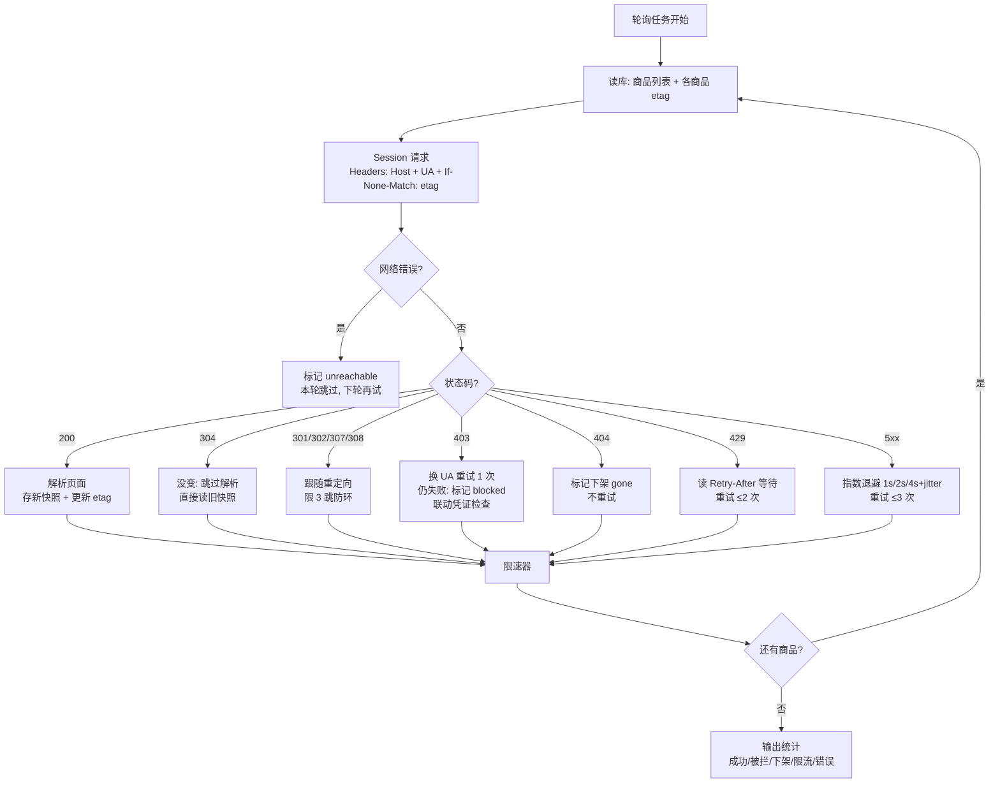

---
{
  "status": "active",
  "created": "2026-09-03",
  "updated": "2026-09-03",
  "source": "crawler-learning",
  "tags": [
    "爬虫",
    "HTTP"
  ],
  "cards": [
    "crawler-301302与30-070",
    "crawler-304为什么没有bo-061",
    "crawler-403429时pa-082",
    "crawler-429后看哪个头决定等-064",
    "crawler-Cookie回传的条件-077",
    "crawler-Date头是什么时区-072",
    "crawler-ETag和Last-074",
    "crawler-HTTP10和1-068",
    "crawler-Playwrightc-085",
    "crawler-SameSiteLax-078",
    "crawler-chunked何时出现-065",
    "crawler-curlv输出分哪-066",
    "crawler-keepalive情-063",
    "crawler-nostoren-073",
    "crawler-originform-067",
    "crawler-为什么S1fetch-084",
    "crawler-服务器不给ETag时-076",
    "crawler-本地http_prox-069",
    "crawler-条件请求四步闭环200-075",
    "crawler-爬虫对2xx3xx-071",
    "crawler-监控抓取断断续续时-080",
    "crawler-让服务器告知变没变-083",
    "crawler-设计500商品价格监-079",
    "crawler-请求响应报文哪几部分对-081",
    "crawler-请求头最小集合是哪几个-062",
    "crawler-静态UA为什么危险-086"
  ]
}
---

# B1 Web 基础（HTTP 协议）— 知识手册

> 用途：**学习/查阅**——知识点常新常查。
> 配套：错题复习 → B1-quiz.md ｜ 过程回溯 → B1-review.md
> 2026-08-07 三文件拆分：手册只留知识，过程性内容已迁 B1-review.md。

## 目录

1. [必答问题（5 题）](#1-必答问题)
2. [报文结构（第 1 课）](#2-报文结构)
3. [状态码（第 2 课）](#3-状态码)
4. [条件请求 ETag（第 3 课）](#4-条件请求-etag)
5. [keep-alive 与 chunked（第 4 课）](#5-keep-alive-与-chunked)
6. [Cookie（第 5 课）](#6-cookie)
7. [反爬与限速（第 6 课）](#7-反爬与限速)
8. [monitor 轮询器总览（毕业评审标准答案）](#8-monitor-轮询器总览)
9. [RFC 原文要点](#9-rfc-原文要点)
10. [误解纠正](#10-误解纠正)
11. [费曼：一句话讲给外行](#11-费曼)

---

## 1. 必答问题

> 读完能答 = 掌握。答不出 → 回对应章节重读。

1. 304 响应为什么没有 body？客户端怎么拿到内容？
2. Set-Cookie 的 SameSite=Lax 对爬虫意味着什么？
3. keep-alive 连接什么情况下会被服务端关闭？爬虫怎么感知？
4. 服务器返回 429 后，标准做法是看哪个响应头决定等多久？
5. chunked 传输编码什么时候出现？requests/httpx 怎么处理它？

## 2. 报文结构

> 场景：一行 `page.goto()` 背后，发/收各一份报文。

**一句话**：HTTP 报文 = 首行 + 头 + 空行 + body，请求/响应**四段对称**；空行是头/body 分界线；IP 不在报文里（TCP 层）。

```
请求（发给服务器）                   响应（服务器返回）
GET /path?memberId=123 HTTP/1.1     HTTP/1.0 200 OK       ← 首行（请求行/状态行）
Host: example.com                    Server: SimpleHTTP/1.0
User-Agent: Mozilla/5.0              Date: Fri, 07 Aug 2026...
Cookie: session=abc                  Content-Length: 417
Accept: text/html                    ETag: "v1"
                                     （空行）               ← 空行 = 分界线
（GET 无 body；POST 才有）            <!DOCTYPE html>...    ← body
```

**关键点**：
- 请求首行 = 请求行：`方法 路径 版本`；响应首行 = 状态行：`版本 状态码 原因`
- **空行是分界线**：解析报文第一步就是找空行，空行前是头、空行后是内容
- **两个 form**（RFC 9112 §3.2.2/3.2.3）：origin-form（发源服务器，只带路径）`GET / HTTP/1.1` vs absolute-form（发代理，带完整 URL）`GET http://host/ HTTP/1.1`——同一 curl 两种形态，看发给谁
- **IP 在哪层**：curl `*` 开头 = 传输层信息（连接/IP），`>`/`<` 开头才是 HTTP 报文
- **HTTPS 看不到明文**：代理层（CONNECT 隧道）→ TLS 层（证书+ALPN 协商 h2）→ HTTP/2 伪头（:method/:scheme/:authority/:path）——要看清 HTTP/1.1 报文，用本地明文服务器
- 踩坑：`--noproxy '*'`（本地调试必带，代理的 127.0.0.1 ≠ WSL 回环）

**PH 落点**：Playwright/requests 替你写报文；人不用手写，但要知道它在哪。
**微题**：B1-quiz.md 批次 5。

## 3. 状态码

> 场景：offers.py 不看状态码 → 在错误页里找商品 → 静默丢数据。

**一句话**：状态码 = 服务器给的暗号，爬虫对每个暗号反应不同；**码错了内容必错**（403/404/429 对浏览器都是"加载成功"，错误页照样渲染）。

**五类暗号表**（记忆锚：**2 成了 / 3 搬家 / 4 你的错 / 5 它的错**）：

| 码 | 含义 | 爬虫动作 |
|----|------|---------|
| 200 | 成功 | 解析页面 |
| 301/302/307/308 | 搬家（带 Location） | 跟随（限跳数） |
| 304 | **没变信号**（无 body 无 Location） | 跳过解析，用旧快照（见 §4） |
| 403 | 被禁止 | 换身份/UA（风控联动凭证检查） |
| 404 | 不存在/下架 | 标记下架（**不重试**） |
| 429 | 限流 | **读 Retry-After** 等待（没有才退避） |
| 5xx | 服务器错误 | 指数退避 1s/2s/4s+jitter 重试 |

**关键认知**：
- **404 ≠ 网络错误**：404 是服务器明确答复"没这个地址"（下架，永久）；网络错误是根本没见到服务器（超时/DNS/拒连，才重试）
- **症状学**：429 = 间歇性限流（"断断续续"）；404 = 永远没了；403 = 被拉黑——症状相似含义不同，全靠码区分
- **301/302 vs 307/308**：301/302 允许 POST→GET 转换（body 丢）；307/308 保留方法；requests 默认跟随（POST 变 GET）、httpx 默认不跟

**PH 落点**：状态码分级方案见 PageHarvest/docs/plan/monitor.md §抓取层（决策表，2026-08-07 细化）；落地对象待定（PH 核心是离线解析）。
**微题**：B1-quiz.md 批次 6。

## 4. 条件请求 ETag

> 场景：S1 monitor 轮询 500 商品，内容没变但每次全量下载——白烧流量还招 429。

**一句话**：比"内容是不是同一个"不比"什么时候改的"——ETag=内容指纹，内容变指纹必变，**没法撒谎**。

**四步闭环**（= S1 增量抓取原型）：
```
① 首次抓取    → 200 + ETag:"v1" + body（拿内容 + 存指纹）
② 带旧指纹问  → If-None-Match: "v1" → 304 + 无 body（没变，跳过解析）
③ 源站价格变了（bump）
④ 旧指纹再问  → 200 + ETag:"v2" + 新 body（变了，重解析 + 存新指纹）
```

**强弱验证器**：

| | Last-Modified | ETag |
|--|--------------|------|
| 描述 | 声称"什么时候改的" | "内容是什么" |
| 精度 | 秒级（同秒双改漏判） | 内容粒度 |
| 能撒谎吗 | 能（缓存服务器/时钟不准） | 不能 |
| 强弱 | 弱验证器 | **强验证器** |

**注意点**：
- 服务器不给 ETag 时退路：Last-Modified / If-Modified-Since（弱验证凑合用）→ 都没有 → 全量抓取+比对内容哈希
- 两者都给：只带 If-None-Match（强验证器优先，RFC 9110 §13.2.2）
- **304 钉死**：没变信号——无 body、无 Location、用旧快照、跳过解析；不是重定向（301 才带 Location 搬家）；不是"跳转"

**PH 落点**：products 表 `etag`/`last_modified` 列 → 轮询带 If-None-Match → 304 跳过解析（monitor.md 已设计）。
**微题**：B1-quiz.md 批次 7。

## 5. keep-alive 与 chunked

> 场景：S1 fetcher 500 次请求，每次都三次握手 = 1500 包纯开销。

**一句话**：keep-alive = 一个 TCP 连接串多个请求（握手只做一次）；chunked = 长度未知时每块挂 hex 长度牌，0 收尾。

**keep-alive 关闭 4 场景**（记忆锚：**旧/说/晾/挤**）：

|     | 场景   | 说明                                        |
| --- | ---- | ----------------------------------------- |
| ①   | 协议旧  | HTTP/1.0 默认短连接（`assume close after body`） |
| ②   | 明说   | 响应带 `Connection: close` 头                 |
| ③   | 空闲超时 | 几十秒不说话，服务器关                               |
| ④   | 满员   | 连接数上限，关最老的                                |

爬虫**无法提前感知，只能透明重连**（连接池自动重建，业务无感）。

**chunked**（RFC 9112 §7.1）：
- 出现时机：响应长度未知（动态/流式生成），无法填 Content-Length
- 格式：`hex长度 + CRLF + 块数据 + CRLF` 循环，`0 + CRLF + CRLF` 结束
- 与 Content-Length **互斥**（同时出现可能是请求走私攻击迹象）
- 库处理：requests/httpx 透明解码；`stream=True` 才逐块（iter_content）

**Session 两理由**（第 4 课核心）：
1. 连接复用（省握手）
2. **cookie 仓库自动回传**（维持登录态）——裸 `requests.get()` = 每次新连接+新柜子，服务器永远不认识你

**PH 落点**：S1 fetcher 必须 Session()；大文件/流式 API 用 stream=True；Playwright 自带连接复用 + HTTP/2。
**微题**：B1-quiz.md 批次 8。

## 6. Cookie

> 场景：factory-monitor 凭证闭环——登录态怎么持久化、怎么验证、怎么重登。

**一句话**：完整闭环 5 步 = 登录 → 持久化存盘 → 加载还原 → **探测验证** → 失效重登。

**8 知识点浓缩**：

1. **闭环**：Set-Cookie（服务器→客户端下发）→ 存储 → Cookie（客户端→服务器回传）。Session() = 模拟浏览器的 cookie 仓库，自动收自动回传
2. **作用域 Domain/Path**：无 Domain 属性=只认设置它的主机（**不含子域**）；带点 `.example.com`=全家族通用；Path 匹配前缀
3. **生命周期**：Max-Age（相对秒，优先）/ Expires（绝对时间）；都不带 = 会话 cookie（session 销毁即没）→ 持久化 = 存盘 JSON 下次加载
4. **Secure**：只在 HTTPS 回传（防窃听）；URL 写 http:// 则不发 → 登录态神秘失效先查 URL
5. **HttpOnly**：JS 读不到（防 XSS）；Playwright `context.cookies(url)` 能拿到（不走 JS）
6. **SameSite**（RFC 6265bis，默认 Lax）：管"什么场景带"；同站≠同域（同站=scheme+可注册域名）；Lax = 跨站**顶级导航**放行，跨站子资源（iframe/img/script）**不放行**
7. **SameSite 对爬虫**：requests 无"跨站发起"概念 → **基本无感**；真坑在 ① 重定向链 cookie 作用域丢失（凶手是 Domain 不是 Lax）② Playwright 页面内跨站子资源才受 Lax 约束
8. **实战流程**：建 Session → 登录 POST（先 GET 抓 CSRF token）→ 持久化 → 重启加载 + **探测"先试后用"** → 失效重登覆盖

**易混四对 + 判案口诀**（登录态丢失排查顺序）：
- Secure vs HttpOnly：**通道 vs 脚本**（Secure=加密通道才传；HttpOnly=JS 读不到）
- Domain vs SameSite：**谁收 vs 怎么发**（Domain=哪个域名收；SameSite=什么场景发）
- 同站 vs 同域：**同域 ⊂ 同站**（a/b.example.com 同站不同域）
- 会话 vs 持久：**有没有寿命**（无 Max-Age/Expires = 会话）
- 排查顺序：① URL 是 https 吗（否则 Secure 不发）② 跨主机跳转了吗（Domain 不匹配）③ 持久化了吗（会话 cookie 没了）④ 浏览器模拟场景吗（才轮到 SameSite）

**探测验证**：不能只看状态码（**200 + 登录页 HTML** 阴险形态）；选**露馅性**接口（没登录就露馅，如搜索页）；判定三板斧：跳 login / 登录框特征 / 正常列表。
**失效处理**：无头过不了验证码 → 探测失败先重试 1-2 次（防抖动误判）→ 确认失效 → **不能自动重登** → 标记 COOKIE_EXPIRED + 通知用户手动重登（有头）→ save_cookies 覆盖。

**PH 落点**：BrowserManager 缺探测验证（待补，时机后定）；S1 凭证管理见 monitor.md §凭证管理。
**微题**：B1-quiz.md 批次 9。

## 7. 反爬与限速

> 场景：sleep(3) 硬编码 + 静态 UA 一行。

**一句话**：403 查身份 / 429 查行为；UA 指纹要自洽（声称 vs JS 实测）；限速要预防不是补救。

**反爬三件套**：

| 维度  | 是什么                         | 被认出症状           |
| --- | --------------------------- | --------------- |
| 身份  | UA / 浏览器指纹（Canvas/WebGL/字体） | 403 / 风控页 / 验证码 |
| 行为  | 请求频率、节奏、顺序                  | 429 限流          |
| 位置  | IP 段、地理                     | 429 / 地区封锁      |


**UA 指纹不配套**：UA 说"我是 Chrome 150"，反爬 JS 一测渲染引擎/Canvas 指纹/字体对不上 → 穿帮。**反爬不信你说的话，信它自己测的**。正确姿势：Playwright 用真实浏览器 UA（`--disable-blink-features=AutomationControlled` 已做）；requests 场景 UA+Accept-Language+Accept **成套**给。

**自适应限速**（monitor.md 已设计）：
```
每商品独立时间戳（最小间隔如 2s，非全局 sleep）
+ 429 反馈：优先 Retry-After，没有则间隔 ×2
+ 成功反馈：连续 N 次成功才缓慢减间隔（防骤增再触发）
+ 触发前预防：渐进加速（低频试探 → 缓加速），非触发后补救
```

**429 风暴**：前 50 成功 → 触发限流 → 后 450 全 429 → 疯狂重试 = 雪崩。自适应 = **触发前降速**。

**指纹一致性总原则**：同一次采集会话，身份/行为/节奏保持一致；忽快忽慢 + 头不配套 = 最像爬虫。

**PH 落点**：monitor.md §抓取层（限速/UA 已设计）；factory-monitor sleep(3) 待改（时机后定）。
**微题**：B1-quiz.md 批次 11。

## 8. monitor 轮询器总览

> B1 毕业评审标准答案（2026-08-07）。六课串线：Session（§5）+ 请求头（§2）+ 状态码（§3）+ ETag（§4）+ 限速（§7）+ 凭证（§6）。



**限速器（N）内部**：每商品独立时间戳（最小间隔 2s）→ 429 读 Retry-After（没有 ×2）→ 连续 N 次成功才缓慢减 → 渐进加速防雪崩。

**架构选择**：S1 fetcher 用 **requests/httpx + Session**（连接复用 + cookie 仓库），不用 Playwright（500 商品开浏览器太重）；Playwright 留给 factory-monitor（1688 重反爬）。

## 9. RFC 原文要点

| 主题 | 出处 | 要点 |
|------|------|------|
| 报文结构/请求行两种 form | RFC 9112 §3.2.2/3.2.3 | origin-form vs absolute-form |
| 方法安全/幂等 | RFC 9110 §9.2 | 爬虫只用 GET/HEAD/POST；405 看 Allow |
| 状态码 | RFC 9110 §10 | 2xx 成 / 3xx 搬家 / 4xx 你的错 / 5xx 它的错 |
| Retry-After | RFC 9110 §10.2.3 | 429 优先读它（秒数或 HTTP-date） |
| 304/条件请求 | RFC 9110 §13.2.2 | If-None-Match 优先于 If-Modified-Since |
| 缓存指令 | RFC 9111 §5.2.1 | no-cache=可存但每次必须验证；no-store=禁止存储 |
| keep-alive | RFC 9112 §6 | 1.0 短 / 1.1 默认长；4 种关闭场景 |
| chunked | RFC 9112 §7.1 | hex 长度牌 + 0 收尾；与 Content-Length 互斥 |
| Cookie | RFC 6265 §5.3 | Max-Age 优先于 Expires；Domain/Path/Secure/HttpOnly/SameSite |
| 同站定义 | RFC 6265bis | 同站 = scheme + 可注册域名；默认 Lax |
| 百分号编码 | RFC 3986 §2.1 | GBK 关键词 quote 编码（factory-monitor 已做对） |
| Date 头 | RFC 9110 §5.6.7 | UTC，比北京时间慢 8h |

## 10. 误解纠正

> 初学时的错误心智模型 → 被什么证据纠正。最重要的一节。

1. **"curl -v 打 HTTPS 看到的 `> GET / HTTP/2` 就是完整报文"** → 错。那只是 curl 翻译给人看的；线上是伪头（:method/:scheme/:authority/:path）。真报文要打 http:// 明文或本地服务器。
2. **"127.0.0.1 在 WSL 和 Windows 是同一个"** → 错。WSL 回环是独立网络命名空间。`http_proxy` 劫持 → 代理连它自己的 127.0.0.1 → Empty reply 52 → `--noproxy '*'`；requests 对应 trust_env。
3. **"服务器回什么 HTTP 版本就跟我发的相同"** → 错。python http.server 默认回 HTTP/1.0，curl 一看就假设短连接。
4. **"301/302 和 307/308 只是编号不同"** → 错。301/302 允许 POST→GET 转换（body 丢）；307/308 强制保留方法。
5. **"requests 和 httpx 对重定向默认行为一样"** → 错。requests 默认跟（POST 会被转 GET）；httpx 默认不跟。
6. **"Cache-Control: no-cache = 不要缓存"** → 错。no-cache 允许存储但每次使用前必须验证（RFC 9111 §5.2.1.4）；no-store 才是禁止存储。京东首页 no-store = 千人千面 + 强时效。
7. **"ETag 和 Last-Modified 可以二选一随便带"** → 错。都给时带 If-None-Match（强验证器），服务器 MUST 忽略 If-Modified-Since（RFC 9110 §13.2.2）。
8. **"304 就是服务器固定回的状态"** → 错。真实服务器是**评估**条件头：If-None-Match 匹配 → 304，不匹配 → 200+新内容。status_lab 的 /304 是无条件简化版，conditional.py 才是真实逻辑。
9. **"404 是网络错误"** → 错（答辩错题）。404=服务器明确答复没这个地址（下架，不重试）；网络错误=没见到服务器（才重试）。
10. **"304 是重定向/跳转"** → 错（三连错，已钉死）。304=没变信号，无 body 无 Location；301=指路牌（搬家带 Location）。
11. **"304 后从 cookie 取内容"** → 错（批次 13 新错法，比 #10 更退步）。cookie 是**会话凭证**（名值对），不是内容仓库；304 后内容用**本地缓存**（上次 200 响应存的 body，ETag/Last-Modified 验证后直接用）。对应增量抓取：304 → 跳过解析用旧快照。
12. **"Host 是告诉目标 IP"** → 错（批次 13）。IP 是 **TCP 层**的事（URL 解析后建立连接用）；Host 是**主机名**（RFC 9112 §3.2），服务器靠它做**虚拟主机路由**——一个 IP 上挂多个站点，靠 Host 区分路由到正确站点。
13. **"Cookie 回传只要 Domain 对就行"** → 错（批次 14，漏 Path）。四要素：**Domain**（含子域，`domain=.example.com` 覆盖 www）+ **Path**（前缀命中，`/cart` 的 cookie 不回传给 `/`）+ **Secure**（仅 HTTPS）+ **未过期**（Expires/Max-Age；服务端 `Max-Age=0` 可主动注销）。爬虫坑：重定向链跨域丢 cookie。
14. **"304/200 处理答得出但闭环收尾漏了（200 后不更新 ETag）"** → 错（批次 15）。四步闭环最后一步：**200 响应带新 ETag → 必须更新存储**，下次才带新值。不更新 → 永远带旧验证器，要么永远 304（错过新内容）要么永远 200（白请求）。对应增量抓取：**变化时重存 ETag 是增量抓取的前提**。
15. **"curl -v 的四层 = 请求行/头/空行/body"** → 错（7 天轮批次 16）。curl -v 的四层是**输出层次**：① 连接建立（TCP/代理 CONNECT）② TLS 握手 ③ 发送的请求头（`> ...`）④ 收到的响应头（`< ...`）。请求行/头/空行/body 是 **HTTP 报文格式**（RFC 9112 §3）——两码事。HTTPS 看不到 HTTP/1.1 明文 = TLS 加密（+HTTP/2 伪头二进制帧双保险）。
16. **"3xx = 有更新"** → 错（7 天轮批次 17）。3xx = **重定向/搬家**（301 指路牌带 Location；304 才是"没变"信号，无 body 用缓存）。"有更新"是 200 的事。4xx/5xx 的完整策略：2xx 成（解析 body）/ 3xx 搬家（跟随限跳数，304 例外）/ 4xx 你的错（403 换身份、404 下架不重试、429 听 Retry-After）/ 5xx 它的错（503 退避）。

## 11. 费曼

> 一句话讲给外行：讲不清楚 = 没懂。

> curl 抓 HTTPS 站点，看到的报文是"套了三层盒子"的（代理隧道 → TLS 加密 → HTTP/2），想看清 HTTP/1.1 报文长啥样，得对着本地不开加密的服务器抓。服务器回 301 就是告诉你"这东西搬家了，新地址在 location 头里"；回 304 就是"没变，用你手里那份"。爬虫守则：2 成了 / 3 搬家 / 4 你的错 / 5 它的错——每个码都有对应的动作，别把 404 当网络错误，别把 429 当失败狂重试，ETag 是内容指纹（变没变一问便知），限速要预防不要硬等。

## 回顾
<!-- cards: crawler-301302与30-070, crawler-304为什么没有bo-061, crawler-403429时pa-082, crawler-429后看哪个头决定等-064, crawler-Cookie回传的条件-077, crawler-Date头是什么时区-072, crawler-ETag和Last-074, crawler-HTTP10和1-068, crawler-Playwrightc-085, crawler-SameSiteLax-078, crawler-chunked何时出现-065, crawler-curlv输出分哪-066, crawler-keepalive情-063, crawler-nostoren-073, crawler-originform-067, crawler-为什么S1fetch-084, crawler-服务器不给ETag时-076, crawler-本地http_prox-069, crawler-条件请求四步闭环200-075, crawler-爬虫对2xx3xx-071, crawler-监控抓取断断续续时-080, crawler-让服务器告知变没变-083, crawler-设计500商品价格监-079, crawler-请求响应报文哪几部分对-081, crawler-请求头最小集合是哪几个-062, crawler-静态UA为什么危险-086 -->
- Q: 304 为什么没有 body？客户端靠什么拿到内容？304 是重定向吗？
  A: - 304 = "没变"信号（3xx 无 body 无 Location，RFC 9110 §15.4.5）；服务端不发 body = 内容没变客户端已有，发了浪费带宽
  - 客户端靠**本地缓存**（上次 200 存的 body）+ 验证器（ETag/Last-Modified）确认后直接使用
  - **301 = 指路牌（搬家带 Location）；304 = 盖章（没变照用）**；304 对应增量抓取 = 跳过解析用旧快照

- Q: 请求头最小集合是哪几个？只留一个留哪个？Host 起什么作用？
  A: - **Host = HTTP/1.1 唯一必须请求头**（RFC 9112 §3.2）——虚拟主机路由：一个 IP 挂多域名，服务器靠 Host 区分；**IP 是 TCP 层的事**，不在报文里
  - 爬虫最小实用三件套：Host + UA（礼貌+反爬）+ If-None-Match（增量前提）

- Q: keep-alive 情况下服务端关闭连接的理由？哪个是服务器"明说"？爬虫要手动处理吗？
  A: - 记忆锚「**旧/说/晾/挤**」：① 协议旧（HTTP/1.0 默认短连接）② 明说（`Connection: close` 头）③ 空闲超时（晾着不说话）④ 满员（连接数上限关最老）
  - 爬虫无感：**透明重连**（连接池自动重建），不用手动处理

- Q: 429 后看哪个头决定等多久？429 和 503 的处理差异？
  A: - 429 第一优先读 **Retry-After**（秒数/HTTP-date），没有才退避；`time.sleep(int(retry_after))` 前 try/except（服务端可能给坏值）
  - 语义层：**429 = 服务器没问题（客户端频率问题，冷却即可）vs 503 = 服务端过载（退避试探）**

- Q: chunked 何时出现？块格式长什么样？结尾标志？库怎么处理？
  A: - 出现时机：**响应长度未知**（动态生成/流式输出）；长度已知的大文件反而用 Content-Length；两者互斥（RFC 9112）
  - 块格式：`<hex长度>\r\n<数据>\r\n` 重复，**`0\r\n\r\n` 结尾**
  - requests **默认透明解码**拼回完整 body；stream=True 才逐块

- Q: curl -v 输出分哪四层？为什么 HTTPS 站点看不到 HTTP/1.1 明文？
  A: - 四层 = **输出层次**：① 连接建立（TCP/代理 CONNECT）② TLS 握手 ③ 发送的请求头（`>`）④ 收到的响应头（`<`）——不是报文结构！
  - 看不到明文 = TLS 加密应用层数据 **+** HTTP/2 二进制帧（连 HTTP/1.1 文本格式都不存在）——**双保险**，不是单纯"加密了"

- Q: origin-form 和 absolute-form 的区别？分别发给谁？
  A: origin-form `GET / HTTP/1.1` → 源服务器；absolute-form `GET http://host/path HTTP/1.1` → 正向代理（RFC 9112 §3.2.2/3.2.3）；同一 curl 两种形态取决于发给谁

- Q: HTTP/1.0 和 1.1 对 keep-alive 的默认行为差异？
  A: 1.0 默认短连接（`Connection: keep-alive` 才长）；1.1 默认长连接（`Connection: close` 才短）

- Q: 本地 http_proxy 劫持怎么破？requests 对应什么？
  A: - 坑源 = **环境变量 http_proxy**（requests 默认 trust_env=True 信任它），不是 VPN
  - 破法：curl `--noproxy '*'` / requests `trust_env=False` 或显式 `proxies={}`

- Q: 301/302 与 307/308 对 POST 的处理差异？requests 与 httpx 默认跟随行为？
  A: - 301/302：允许 POST→GET（丢 body，RFC 9110 §15.4）；307/308：**强制保留方法+body**
  - **requests 默认跟重定向（POST 被 302 转 GET 丢 body）；httpx 默认不跟（follow_redirects=False）——两库相反**

- Q: 爬虫对 2xx/3xx/4xx/5xx 的通用处理策略？（拿到码后干什么）
  A: - 口诀：**2 成了（解析 body）/ 3 搬家（跟随限跳数，304 例外用缓存）/ 4 你的错（403 换身份、404 下架不重试、429 听 Retry-After）/ 5 它的错（指数退避）**
  - 404 = 服务器明确答复"没有"（永久下架），重试完全浪费；网络错误（-1）才是暂时故障

- Q: Date 头是什么时区？爬虫时间解析的坑？
  A: UTC（RFC 9110 §5.6.7，比北京慢 8h）；**存储统一 UTC 不转本地，展示才转**（转来转去引入夏令时/时区混乱）；解析用 `email.utils.parsedate_to_datetime()` 别手切字符串

- Q: no-store / no-cache / 无指令 三者的缓存行为差异？
  A: - 递进：**存都不存（no-store）/ 存了每次验（no-cache）/ 存了放心用旧的（无指令=启发式缓存）**
  - no-cache = 可存储但每次使用前必须回源验证（RFC 9111 §5.2.1.4）——不是"不缓存"也不是"保持默认"

- Q: ETag 和 Last-Modified 哪个强？同时存在时带哪个头？
  A: ETag = 内容指纹强验证器（不能撒谎）；Last-Modified = 秒级精度弱验证器（能撒谎）；同时给时只带 **If-None-Match**（服务器 MUST 忽略 If-Modified-Since）

- Q: 条件请求四步闭环（200+ETag → 304 → 变化 → 200+新ETag）对应增量抓取的什么？
  A: - 四步：① 首次 200 + body + ETag → **存** ② 轮询带 `If-None-Match: <旧ETag>` ③a 没变 → 304 → 用旧快照跳过解析 ③b 变了 → 200 + 新 body + **新 ETag** ④ **更新存储的 ETag**
  - 不更新 → 永远 304（错过新内容）或永远 200（白请求）——S1 fetcher 核心

- Q: 服务器不给 ETag 时增量抓取怎么退路？
  A: ① Last-Modified/If-Modified-Since（弱验证，凑合用）② 都没有 → **全量抓取 + 比对内容哈希**（最笨但永远有效）

- Q: Cookie 回传的条件是什么？（什么时候带、什么时候不带）
  A: - 四要素：① **Domain** 匹配（含子域，`domain=.example.com` 覆盖 www）② **Path** 前缀命中（`/cart` 的 cookie 不回传给 `/`）③ **Secure** 仅 HTTPS ④ **未过期**（Expires/Max-Age；`Max-Age=0` 主动注销）
  - 爬虫坑：重定向链跨域丢 cookie

- Q: SameSite=Lax 对爬虫意味着什么？坑在哪？
  A: - SameSite=Lax = 跨站请求不发 cookie（顶级导航 GET 例外）
  - 对爬虫：requests/httpx 不执行浏览器同源策略 → 基本无感；**坑在 Playwright**（跨站子资源请求被拦 cookie）+ 重定向链跨域作用域丢失

- Q: 设计 500 商品价格监控轮询器：用什么客户端？状态码怎么处理？ETag 怎么用？限速怎么做？
  A: - 客户端：requests/httpx + Session（连接复用+cookie 仓库）；Playwright 留给重反爬站点（500 商品开浏览器太重）
  - 状态码：200 解析 / 304 跳过解析用旧快照 / 301-308 跟随限跳数 / 403 换身份 / 404 标记下架 / 429 读 Retry-After / 5xx 指数退避+抖动
  - **ETag 条件请求 = monitor 命根子**（存 products 表 etag 列）
  - 限速：每商品时间戳 + 自适应（429 后按 Retry-After 拉长）

- Q: 监控抓取"断断续续"（时好时坏），诊断根因？
  A: - 主因：**429 频繁（间歇性限流）** + IP 封控冷却
  - 排除：404 = 永久下架（持续缺失，不产生断续）；"数据储存被刷新"与断续无关（概念串）
  - 网络波动要说清是"网络错误"（连接层）非 404

- Q: 请求/响应报文哪几部分对称？空行起什么作用？你的 IP 在报文里吗？
  A: - 四段对称：**首行 + 头 + 空行 + body**（请求首行=请求行，响应首行=状态行）
  - **空行 = 分界线**（头部到此结束，后面是 body）——不是占位
  - IP 不在 HTTP 报文里，在 TCP/IP 层（curl `*` 行=连接层，`>`/`<`=报文）

- Q: 403/429 时 page.goto() 会报错吗？之后会在哪个页面找商品？404 呢？
  A: - 403/404/429 对浏览器都是"加载成功"，**错误页照样渲染**——码错了内容必错；Playwright 只等加载事件
  - 403/429/404 症状相同（错误页静默跳过）含义不同：404=下架（永久）/ 403=被拉黑（换身份）/ 429=太快（退避）

- Q: 让服务器告知"变没变"（不下载全量）怎么做？时间戳方案有什么漏洞？为什么 ETag 补上？
  A: - 时间戳方案 = **Last-Modified/If-Modified-Since 的真实机制**（文无独立设计出协议，神预判）
  - 漏洞：时间戳是服务器"声称"，能撒谎；秒级精度同秒双改漏判；缓存服务器/时钟不准漏更
  - **ETag = 内容指纹，内容变指纹必变，没法撒谎**——强验证器本质

- Q: 为什么 S1 fetcher 必须用 Session？chunked 何时见原始块？
  A: - Session 两理由：① **连接复用省握手**（500 次请求不开 500 次连接）② **cookie 自动回传维持登录态**（不是"防封"）
  - chunked：stream=True 才见原始块（默认透明拼回）

- Q: Playwright cookie 持久化闭环缺哪步？探测接口怎么选？探测失败自动重登还是手动？
  A: - 5 步闭环：登录 → 持久化存盘 → 加载还原 → **探测验证** → 失效重登（factory-monitor 只有前 3 步）
  - 验证不能只看状态码：**阴险形态 200+登录页 HTML**（码和内容分开看）
  - 探测接口判据 = **露馅性**（没登录就露馅）；判定三板斧：URL 跳 login=失效 / 200 但登录框特征=失效 / 正常列表=有效
  - 探测失败：先重试 1-2 次（指数退避）→ 仍失败=确认失效 → **不能自动重登**（卡验证码+触发风控）→ 标记 COOKIE_EXPIRED + 通知人工（有头）→ save_cookies 覆盖

- Q: 静态 UA 为什么危险？"指纹不配套"指什么？429 前怎么自动降速？
  A: - 静态 UA 危险机制：**UA 声称版本 vs JS 实测环境对不上**（UA 说 Chrome 150，JS 一测渲染引擎/Canvas/字体列表对不上 → 穿帮）——反爬不信你说的话，信它自己测的
  - 403 查身份（浏览器头真实性）/ 429 查行为（限速）+ 位置（IP 段）
  - 429 前降速（预防而非补救）：每商品独立时间戳最小间隔 + **渐进加速**（低频试探→缓加速）+ **恢复缓慢**（连续 N 次成功才减一点，防骤增再触发）
