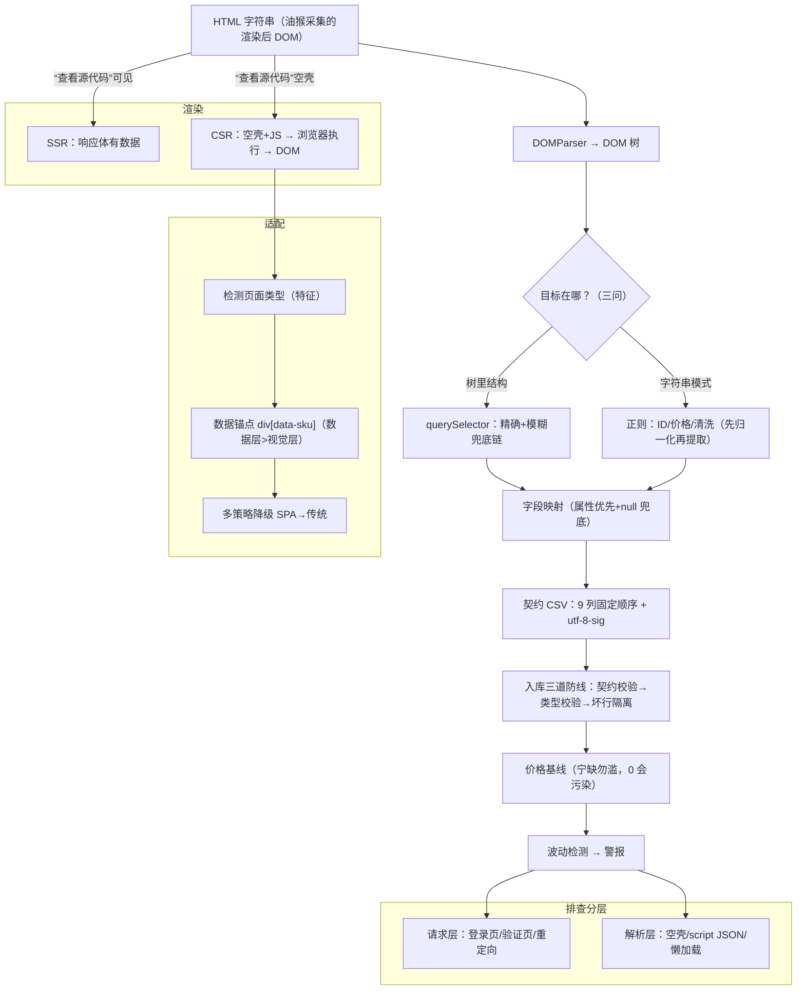

---
{
  "status": "active",
  "created": "2026-09-03",
  "updated": "2026-09-03",
  "source": "crawler-learning",
  "tags": [
    "爬虫",
    "解析"
  ],
  "cards": [
    "crawler-185412-091",
    "crawler-CSV契约解决什么问题-096",
    "crawler-HTML文本和DOM-087",
    "crawler-React页面查看源代-093",
    "crawler-divclass-089",
    "crawler-requests200-094",
    "crawler-为什么商品ID用正则-092",
    "crawler-为什么正则回答不了哪个-088",
    "crawler-为什么用divdat-095",
    "crawler-前端容错vs入库防线-097",
    "crawler-怎么选中acla-090"
  ]
}
---

# B2 解析知识手册（HTML/浏览器渲染管线）

> 用途：**学习/查阅**——知识点常新常查。
> 配套：错题复习 → B2-quiz.md ｜ 过程回溯 → B2-review.md
> 教材：PageHarvest 即教材（site/assets/js/parser.js + parsers/*.js），对话式教学，不引外部资料。

## 目录

1. [必答问题](#1-必答问题)
2. [第 1 课 HTML → DOM：为什么解析 HTML 不能只靠正则](#2-第-1-课)
3. [第 2 课 CSS 选择器与提取定位](#3-第-2-课)
4. [第 3 课 正则提取的边界](#4-第-3-课)
5. [第 4 课 浏览器渲染管线（SSR vs CSR）](#5-第-4-课)
6. [第 5 课 SPA 与动态渲染适配](#6-第-5-课)
7. [第 6 课 解析工程化](#7-第-6-课)
8. [B2 总览图（毕业评审标准答案）](#8-总览图)
9. [RFC/参考要点](#9-rfc参考要点)
10. [误解纠正](#10-误解纠正)
11. [费曼：一句话讲给外行](#11-费曼)

---

## 1. 必答问题

> 开课时定 3-5 题，读完能答 = 掌握。答不出 → 回对应章节重读。

1. 为什么"用正则解析 HTML"不可靠？DOM 解析器（DOMParser）和正则的分工边界是什么？
2. 浏览器如何容错"不合法"的 HTML？DOMParser 的解析结果和真实浏览器 DOM 一致吗？
3. CSS 选择器（querySelector）怎么应对页面改版？PH 里为什么大量用 `[class*="xxx"]` 模糊匹配？
4. SSR 和 CSR 的区别？为什么 SPA 页面"查看源代码"抓不到商品数据，而 PH 却能解析？
5. 解析工程化的关键实践？PH 怎么处理脏数据（字段缺失/编码/坏行）？

## 2. 第 1 课

> 场景：PH 拖进一个 1688 搜索页 HTML，parser.js 第一件事是 `new DOMParser().parseFromString(html, 'text/html')` 把字符串变成 document 再 querySelector；但 JD 新版 React 页面的参数表、无引号类名，JDParser 又直接靠正则抠。同样是"从 HTML 里取数据"，为什么两套手段并存？

**一句话**：HTML 是树，正则是一维扫描——"用正则解析 HTML"理论上不完备；浏览器自带容错解析器（DOMParser）能把任意 HTML 变成标准 DOM 树，但数据若嵌在特定字符串模式里（JSON、类名、script），正则反而更快更稳。

**第 0 步：HTML 是什么**（2026-08-10 批次 1 起收录：从零版，不假设 Web 基础）
- 网页本质是一个**文本文件**，用"标签"标注内容：`<p>你好</p>` = 一个段落；`<a href="https://a.com">点我</a>` = 一个链接（href 属性存地址）
- 标签成对出现：`<p>` 开头、`</p>` 结尾；**标签可嵌套**（像文件夹套文件夹）
- PH 采集的商品页就是这种文件：商品卡片 ≈ 一个 `<div>` 容器，里面套标题链接 `<a>`、价格 `<span>`、图片 ``——PH 要做的就是从文本里把标题/价格/图片捞出来

**第 1 步：DOM 树 = 把嵌套画成树**
- 嵌套本身就是树（数据结构视角）：`<div><p>苹果</p><span>100元</span></div>` → div 是根，p/span 是子
- HTML 文本 = 原材料（一维字符流）；**DOM 树** = 整理好的结构（二维树）；`DOMParser` 就是"文本→树"的工具：`parseFromString(html)` → 一棵树
- 有了树就能问问题："div 里第一个 p 是什么？" → `querySelector('div p')`
- **解析的本质：一维文本 → 二维树 → 按结构取数据**
- **两个必须记牢的树细节**（批次 1 的坑）：
  1. **一个 HTML 文档 = 一棵 DOM 树**（根是 document）；不存在"一个文本多棵树"；iframe 是多文档各自成树的特例
  2. **文本也是节点**（文本节点）：`<p>苹果</p>` = p 元素节点 + "苹果"文本节点；`<div><p>苹果</p><p>香蕉</p></div>` = 3 元素节点 + 2 文本节点 = 5 节点

**第 2 步：为什么正则干不了这事**（直觉版）
- 正则一行行扫文本，**没有层级记忆**：`<div><p>苹果</p></div><p>香蕉</p>`——正则扫到两个 `<p>`，但不知道哪个在 div 里（记不住"进过 div 没出来"）
- 正则 = 找关键词（适合扁平模式：数字/ID/URL）；DOM = 整理成目录树再查（适合结构位置）
- **判断标准**：数据在树的结构里 → DOM；数据在字符串的模式里 → 正则

**第 3 步：PH 为什么两套手段并存**
- 有些数据不在树里、在字符串里：商品 ID 藏在链接 `https://detail.1688.com/offer/12345678.html` → `/offer/(\d+)/` 抠出；JD 新版页面无引号类名 → 正则扫 `class=xxx` 比 querySelector 更稳
- 分工不是偷懒，是各干各的活

**关键点**（理论精度版）：
- **HTML 不是正则语言**：HTML 允许无限嵌套的递归结构，正则（有限状态自动机）表达不了嵌套平衡。经典结论：永远不要用正则解析 HTML——但"从 HTML 文本里提取某个字符串模式"是完全正当的。
- **浏览器容错是规范的一部分**：WHATWG HTML 标准定义了树构建算法（tree construction），遇到 tag soup 自动修正：
  - 可选结束标签自动补全：`<p>a<p>b` → 两个 `<p>`；`<li>`/`<tr>`/`<td>` 同理
  - 属性可无引号：`<div class=abc>` 合法
  - 错误嵌套按规范重排：`<b><i>x</b></i>` → `<b><i>x</i></b>`（i 先闭合）
  - 结果：**任何** HTML（哪怕"不合法"）交给解析器都能得到一棵"合理"的树
- **DOMParser 与页面加载同算法**：`parseFromString(html, 'text/html')` 走的就是浏览器加载页面时的 HTML 解析算法（HTMLParser），所以解析结果和真实页面 DOM 一致——这是"解析结果 = 用户看到的"的保证。
- **正则的适用边界（判断标准）**：目标是**树里的元素** → DOMParser + 选择器；目标是**字符串里的模式** → 正则。PH 里正则全是模式提取：
  - `alibaba.js` 的 `extractProductId`：从链接/script 里抠 `/offer/(\d+)/`——ID 是扁平模式，不是结构
  - JD 新版 React 页面：参数表以无引号类名（`class=xxx`）出现，类名在 HTML 字符串里是"模式"，正则比 querySelector 更直接
- **DOMParser 复用**：解析很贵（一次完整树构建），PH 曾每页建 3 次，优化成 1 次复用。

**PH 落点**：parser.js 的 `parseFromString`（DOMParser 复用 3→1）；alibaba.js `extractProductId`（正则抠 ID）；JD 无引号类名正则（`[class*="xxx"]` 失效时的 `class="?xxx` 方案）；`text()` 工具函数（节点取文本）。
**微题**：B2-quiz.md 批次 1。

## 3. 第 2 课

> 场景：树建好了（DOMParser 完事），接下来怎么从树里精准取到标题/价格/销量？alibaba.js 里写满了 querySelector，但用的不是 `div` 这种简单标签，而是 `.offer-title-row a, .title a, [class*="title"] a` 这种花哨写法——为什么？

**一句话**：CSS 选择器 = 给树"指路"的地址语法（标签/类名/属性/层级/或），PH 大量用 `[class*="xxx"]` 模糊匹配 + 多选器降级链——因为 React 页面类名带随机 hash，精确匹配改版就碎。

**知识点**（锚点：树；从批次 1 的 DOM 树出发）：

1. **选择器是什么**：一棵树建好后，怎么告诉程序"我要第 2 层的那个 a 标签"？选择器就是定位语法，`querySelector('div a')` = "div 里（任意层级）的 a".
2. **5 个语法块**（以 PH 真实代码为例）：
   - **标签名**：`div` / `a` / `span`
   - **.类名**：`.title` = `class="title"` 的元素；`.offer-title-row` = class 恰好是 offer-title-row
   - **属性模糊 [attr*="x"]**：`[class*="title"]` = class 属性里**包含** "title"（任意位置）——PH 主力。React 页面类名是 `offer-title-row_1a2b3c`（语义名+随机 hash），`.offer-title-row` 精确匹配直接失效，`[class*="title"]` 照样命中
   - **后代（空格）**：`a[href*="offer/"]` 里的 `[href*="offer/"]` 是属性过滤；`div a` = div 内任意层级 a
   - **或（逗号）**：`.offer-price-row, .price, [class*="price"]` = 命中任意一个即可，按顺序降级
3. **PH 的三层降级链**（核心策略）：
   - 容器：`.offer-list-item-wrap, [class*="offer-list-item"], .search-offer-item, [class*="search-offer-item"]` → 精确先试，模糊兜底
   - 更狠的兜底：找不到容器 → `div[class*="offer"]` 全捞 → 再 filter 过滤（必须含标题或链接元素）——"宁可多抓再筛，不漏"
   - 字段：标题 `.offer-title-row a, .title a, [class*="title"] a, [class*="title"]` 从精确到模糊
4. **懒加载属性链**：图片 `data-sf-original-src → data-lazyload → data-src → src`——页面没滚动时 src 可能是占位图，真实图在 data-* 里；属性优先级也是降级链
5. **选择器 vs 正则（呼应第 1 课）**：选择器 = 树内寻址（浏览器引擎优化，快）；正则 = 字符串模式。JD 无引号类名导致选择器失效时 → 正则兜底（两套手段的第三层防线）

**PH 落点**：alibaba.js 搜索页（容器/标题/价格/销量/链接五条降级链）；JD React 适配（无引号类名 → 正则兜底）；懒加载图片属性优先级链。
**微题**：B2-quiz.md 批次 2。

## 4. 第 3 课

> 场景：第 1/2 课定了分工（树→DOM，字符串→正则）。现在看 PH 里正则具体抠什么：商品 ID（藏在 URL 和 script JSON 里）、价格数字（藏在 "¥1,234.50 起" 里）、销量（藏在 "已售 2万+" 里）、JD 价格区（无引号类名时选择器失效）。

**一句话**：正则的适用边界 = 目标藏在**字符串里的一段扁平模式**（数字/ID/短文本），能用字符规则描述、不需要理解层级上下文；一旦要"第几个/在谁里面"→ 立刻回 DOM。判据三问。

**知识点**：

1. **四个真实案例**（PH 代码拆解）：
   - **商品 ID 双提取**（alibaba.js）：URL 提取 `/detail\.1688\.com\/offer\/(\d+)/` + script JSON 提取 `/"offerId"\s*:\s*(\d+)/`——同一 ID 两种藏法（链接里 / script 里），两种正则分别抠
   - **价格清洗**（alibaba.js）：`priceText.replace(/,/g, '').match(/[\d]+(?:\.[\d]+)?/)`——**先归一化再提取**：先去千分位逗号，再抠数字（`(?:\.[\d]+)?` 表示小数可有可无）
   - **标题去后缀**：`/<title>([^<]+)<\/title>/` 抠出标题，再 `.replace(/\s*[-–—]\s*阿里巴巴.*$/, '')` 去掉站点后缀
   - **JD 无引号类名**：`class="?top-name`（`?` 是量词 = 前一个字符/组出现 0 或 1 次，所以引号可有可无，兼容 `class="top-name"` 和 `class=top-name` 两种写法）
   - **cleanSales**（monitor-save.js，昨天写的）：`/(\d+(?:\.\d+)?)\s*(万|w)?/i`——数字+单位一起抠，`万`→×10000
2. **正则的边界判据（三问）**：
   - Q1 目标在**树里**还是**字符串里**？→ 树里选 DOM
   - Q2 模式是否**扁平**（无嵌套/无层级）？→ 需要层级理解就 DOM
   - Q3 是否需要"**第几个/在谁里面**"？→ DOM（querySelectorAll 拿数组按下标）
   - 正则 = 从左到右扫 + 有限记忆，记不住层级和计数（呼应第 1 课 Q3）
3. **正则实战的四个坑**（PH 的防法）：
   - 千分位逗号：先 replace 再 match
   - 可选小数：`(?:\.[\d]+)?`
   - null 兜底：`priceMatch ? parseFloat(priceMatch[0]) : 0`（match 找不到返回 null，不兜底就崩）
   - 引号可选：`"?`（无引号属性合法的实战应用）
4. **呼应前两课**：JD 无引号类名 = 选择器失效 → 正则兜底。同一数据的取法在两种工具间切换，切换边界就是"选择器能不能表达这个目标"。

**PH 落点**：extractProductId / extractPrice / extractTitle / JD priceRe（class=price 整块区）/ monitor-save.js cleanSales（现学现用：昨天刚写的代码就是本课知识点）。
**微题**：B2-quiz.md 批次 3。

## 5. 第 4 课

> 场景：PH 的三个油猴脚本（platform-1688/jd/zkh.user.js）都在浏览器里**等渲染完成**再取 `document.documentElement.outerHTML`（1688：滚动触发懒加载 + 25s 兜底；JD：waitForProducts + humanScroll）。为什么不能直接 requests GET？——因为 JD 搜索页是 React SPA，服务器返回的是空壳。

**前置：JS 是什么（2026-08-10 补课）**
- HTML = 一页写死的说明书（浏览器读它画出来，页面是死的）；JS = 让页面活起来的脚本语言，**浏览器内置 JS 引擎（解释器）**，类比 Python 解释器跑 .py
- HTML 里嵌 `<script src="app.js"></script>` → 浏览器边加载边执行遇到的 script → JS 能改 DOM、发网络请求（fetch，类比 requests）、响应交互
- 所以"浏览器在线跑 JS" = 浏览器是 JS 的执行环境，遇到 script 就解释执行

**一句话**：渲染管线 = HTML→DOM→CSSOM→渲染树→布局→绘制；SSR 把数据填进服务器返回的 HTML（查看源代码可见），CSR（SPA）只返回空壳 + JS bundle，数据是浏览器跑 JS 后才进 DOM 的——所以"查看源代码"看不到，但**渲染后的 DOM** 里有；PH 靠油猴（采集端在浏览器内）拿到渲染后 DOM。

**知识点**：

1. **渲染管线全貌**（第 1 课的 DOMParser 只是第一步）：
   ```
   HTML → DOM 树（解析）→ CSSOM（CSS 解析）→ 渲染树（合并可见元素）→ 布局（几何）→ 绘制（像素）
   ```
   - 浏览器**边下载边解析边渲染**（渐进式），不是等全部完成
   - 爬虫视角：只要 DOM 树阶段就有数据可提取；布局/绘制是纯展示
2. **SSR vs CSR**：
   - **SSR**（传统/服务端渲染）：服务器把数据填进 HTML 再返回 → 响应体里有商品 → 查看源代码可见 → requests 直接解析
   - **CSR**（客户端渲染，SPA）：服务器只返回空壳（`<div id="root"></div>` + JS bundle 链接）→ 浏览器下载并执行 JS → JS 发 API 请求拿数据 → 动态生成 DOM → 用户看到
   - **查看源代码（View Source）= 看服务器原始响应体** → CSR 页面里当然没有数据
3. **PH 的解法：采集端在浏览器内**：
   - 油猴脚本跑在页面里 → 等渲染完成（JD：waitForProducts 轮询商品出现；1688：滚动触发懒加载）→ `document.documentElement.outerHTML` 序列化**当前完整 DOM** → 下载 HTML
   - "采集的是渲染后的 DOM" = PH 能解析 React 页面的**根本原因**
   - 对比：requests 直接 GET SPA → 200 + 空壳 HTML → 解析器空手而归（JD 搜索页 200 但解析空数据的经典坑）
4. **CSR 页面的四个解析特征**（前几课知识在此闭环）：
   - 类名带 hash → 模糊匹配 `[class*="..."]`（第 2 课）
   - 无引号类名 → 正则兜底 `class="?xxx`（第 3 课）
   - 数据嵌 script JSON（`"offerId":...`）→ 正则/JSON 提取（第 3 课 extractProductId 的第二种提取就是它）
   - 懒加载图片 → data-src 属性链（第 2 课）

**PH 落点**：三个油猴脚本的"等渲染→取 outerHTML"策略；JD SPA 适配（re.jd.com/search）；extractProductId 的 script JSON 提取。
**微题**：B2-quiz.md 批次 4。

## 6. 第 5 课

> 场景：JD 搜索页是 React SPA（第 4 课），类名带 hash、无引号、数据分散。PH 的 jingdong.js 怎么适配？核心一行：`doc.querySelectorAll('div[data-sku]')`——用 React 数据驱动的属性锚定卡片，而不是视觉类名。

**前置：React 是什么（2026-08-10 补课）**
- React = JS 工具库，作用：**你给我数据，我自动生成页面**（数据驱动）
- 组件 = "输入数据 → 输出 HTML" 的 JS 函数：`function ProductCard({sku,title,price}) { return <div data-sku={sku}>…</div> }`
- 页面加载后 React 拿数据调函数 → 生成卡片 DOM → 塞进页面（CSR，第 4 课）
- **data-sku 从哪来**：React 把商品 ID 这个**数据**直接写进 div 属性（`<div data-sku={sku}>`）→ 数据层锚点，不是视觉装饰
- React/Vue 同类（数据驱动框架），1688/京东新版都用
- 为什么难解析（串联）：空壳（第 4 课）/ 类名带 hash（第 2 课）/ 结构不可控（第 3 课）/ 数据写进 data-*（反而是锚点，本课）

**一句话**：适配 SPA 的钥匙是"找 React 给的数据锚点"（data-* 属性是数据驱动生成的，比视觉类名更接近数据本身），配合属性优先（title 属性拿完整文本）+ 文本级正则扫（价格分散）+ 多策略降级（SPA → 传统）。

**知识点**（以 jingdong.js parseSearchSPA 为例）：

1. **锚定：`div[data-sku]`**——React 把商品 ID 写进卡片 div 的 data-sku 属性（数据驱动），用它锚定卡片：
   - 比类名稳：类名是视觉层（可改、带 hash），data-sku 是数据层（ID 必须真实）
   - 比文本稳：不用靠标题/价格猜位置
2. **ID 直接取属性**：`card.getAttribute('data-sku')` → 连正则都不用；链接还能拼：`https://item.jd.com/{sku}.html`
3. **属性 > 文本**：标题取 `span[title], div[title]` 的 title 属性——React 渲染时常把完整标题放 title 属性（防截断），textContent 反而可能被截断
4. **文本级正则扫**：价格 `card.textContent` 全文本 + `/[¥\uffe5]([\d.]+)/g` 全局扫——因为 React 渲染结构不可控，**¥ 和数字可能分属不同标签**（选择器选不准），干脆整卡片文本扫，收集全部金额取 min/max
5. **多策略降级**：`parseSearchSPA(doc)` 失败 → `parseSearchTraditional(doc)`（老页面）；**检测先行**：`isJDProductPage(html)` 用特征（data-sku + goodsCardWrapper / pageConfig + sku / sku-name + p-price…）判断页面类型再选策略
6. **懒加载图片**：`img[data-src]` + 域名过滤（360buyimg/jd.com）+ 协议补全（https:）

**适配思想总结**（本课核心）：检测（页面类型）→ 多策略（SPA/传统）→ 锚定（数据属性）→ 提取（属性优先 + 文本兜底）→ 降级。

**改版应对**（批次 5 补充）：数据锚点属性名变了（data-sku → data-skuid）→ ① 改锚定选择器一行；② 检测函数特征同步加新属性；③ 双锚定降级 `div[data-sku], div[data-skuid]`（新旧页面混存期都能中）；④ 终极防线：数据在 script JSON 时直接抠 JSON，完全不依赖属性名。

**PH 落点**：jingdong.js parseSearchSPA（div[data-sku] 锚定）；extractProductId 的 "offerId" JSON 提取（第 3 课）；JD 新版参数表无引号类名正则。
**微题**：B2-quiz.md 批次 5。

## 7. 第 6 课

> 场景：monitor 的 cli.py `_csv_records` 怎么吃 CSV？——utf-8-sig 打开、列名大小写不敏感对齐、缺失列给默认值、platform/product_id 缺失或 price_low 非法 → 该行 skipped 计数。为什么这么讲究？因为**脏数据是常态，不是异常**。

**一句话**：解析工程化 = 容错（默认值/降级链）+ 隔离（坏行跳过不拖垮整批）+ 可观测（计数/日志）+ **契约先行**（字段名/顺序/编码都是协议的一部分）；前端采集阶段"宁多勿漏"，后端入库阶段"宁缺勿滥"（脏数据会污染价格基线）。

**知识点**（monitor cli.py + 前端 parser 联合教材）：

1. **契约（Schema）先行**：
   - `CSV_COLUMNS` 9 列固定顺序 = 前端生成方与 CLI 消费方之间的**接口契约**
   - 价值：双方独立演进（前端只管生成，CLI 只管消费），字段名/顺序/编码对齐即可
   - 昨天前端 MONITOR_COLUMNS 与 cli.py CSV_COLUMNS 逐一核对——就是契约对齐动作
   - **列名大小写不敏感对齐**：header 手写可能 Platform/Price_LOW 混写，`field_lower` 映射兜底
2. **容错三件套**：
   - 前端（采集）：字段缺失 → 默认值（'' 或 0）；提取失败 → 降级链（多选器/属性链）；null 兜底（`priceMatch ? parseFloat(...) : 0`）
   - monitor（入库）：缺失列默认值；空行忽略；**必填校验**（platform/product_id 缺失或 price_low 非数字 → 该行 skipped）
3. **隔离哲学：坏行跳过，不拖垮整批**：
   - "导入 X / 新增 Y / 坏行 Z"——坏行计数，好行照常入库
   - **为什么跳过而不是猜个 0**：价格猜 0 会污染价格基线 → 触发假波动 → 假警报。宁可丢一行，不脏一片
4. **编码是协议的一部分**：utf-8-sig（BOM）——Excel 无 BOM 时用 GBK 猜编码 → 中文乱码；`\uFEFF` 让消费方明确这是 UTF-8
5. **前端 vs 后端的不同取向**：
   - 前端采集："宁可多抓再筛"（第 2 课容器兜底 div[class*="offer"] 全捞再 filter）——漏了就没法补
   - 后端入库："宁缺勿滥"（坏行跳过）——脏了会污染分析

**PH 落点**：monitor cli.py `_csv_records`（契约/必填校验/坏行计数）；parser.js 多选器降级链 + null 兜底；monitor-save.js toMonitorRows（缺失字段 firstOf 默认值）。
**微题**：B2-quiz.md 批次 6。

## 8. 总览图

> B2 毕业评审标准答案（2026-08-10 有条件通过）：六课串线 + 全链路设计。



**毕业评审标准答案（三题）**：
- **Q1 工具链**：HTML 字符串 → DOMParser 建树 → 三问判目标（树里→选择器 / 字符串→正则）→ 字段映射 → 契约输出。价格走"归一化→提取"，链接 ID 走"DOM 定位→正则抠子串"。
- **Q2 SPA 排查**：先看响应体内容归类（请求层 vs 解析层）→ CSR 确认 → 数据锚点（div[data-sku]）→ ID 直取属性 → 链接拼 sku → 双锚定降级。
- **Q3 管道**：契约（字段/编码）定死 → 入库三道防线 → 坏行隔离；"价格面议"跳过不入库（0 污染基线 → 假波动 → 假警报）。

## 9. RFC/参考要点

| 主题 | 出处 | 要点 |
|------|------|------|
| HTML 解析容错 | WHATWG HTML §13（tree construction） | 未闭合/错嵌套/无引号属性 → 规范自动修正 |
| DOM 标准 | WHATWG DOM | 树结构、节点类型、querySelector 引擎 |
| 正则理论 | 计算理论 | 正则 = 有限状态自动机，无法表达嵌套平衡 |

## 10. 误解纠正

> 初学时的错误心智模型 → 被什么证据纠正。最重要的一节。

1. **"正则能解析 HTML，用正则提取就行"** → 错。正则只能做模式提取；树结构解析交给 DOM 解析器。证据：未闭合标签正则怎么处理？`<div><div>x</div>` 到底几个 div？DOM 解析器有规范答案，正则没有。
2. **"HTML 必须合法，浏览器才认"** → 错。HTML 无"必须合法"一说，解析器对任意输入都有定义好的结果（容错是规范的一部分）。
3. **"一个 HTML 文本能解析出多个 DOM 树"** → 错。一个文档 = 一棵树（根是 document）；iframe 是多文档特例，不是"一个文本多棵树"。（批次 1 暴露）
4. **"DOM 树里只有标签节点"（数节点只数标签）** → 错。文本也是节点：`<div><p>苹果</p><p>香蕉</p></div>` = 3 元素节点 + 2 文本节点 = 5 节点。（批次 1 暴露）
5. **"浏览器容错靠正则兜底"** → 错。浏览器解析 HTML 用的是 HTML 解析器（WHATWG 树构建算法），与正则无关；属性无引号（`<div class=abc>`）本就是合法语法。（批次 1 暴露）
6. **"选择器能写成 `.title class`"（把提取字段的意图混进地址语法）** → 错。选择器 = 标签 / .类名 / [属性="值"] 的最小单元组合（如 `a.offer-title`、`a[href*="offer"]`），`class` 是属性名不是标签；选择器只描述结构，字段映射是提取之后的事；选择器必须对应 HTML 真实结构（类名从 HTML 里来，不抄别的代码）。（批次 2 暴露）
7. **"requests 抓到但解析不到数据 = 触发登录跳转"** → 错（偏题）。登录跳转是**请求层**问题（拿到的根本不是商品页 HTML）；解析层排查 = ① 空壳（SPA JS 未执行）② 数据在 script JSON（只查 DOM 没抠 script）③ 懒加载未触发（商品区为空）。排查先分层：页面不对（请求层）vs 页面对但没数据（解析层）。（批次 4 暴露）
8. **"页面改版适配 = 只改函数参数名"** → 错（微）。改的是**锚定选择器字符串**（`div[data-sku]` → `div[data-skuid]`）+ **检测函数特征同步** + **双锚定降级**（`div[data-sku], div[data-skuid]`，新旧页面混存都能中）；函数参数名跟解析目标无关；终极防线是数据在 script JSON 时直接抠 JSON、不依赖属性名。（批次 5 暴露）
9. **"排查第一步先看 DOM"** → 错（1 天轮批次 19，毕业薄弱点仍没抓住）。requests 拿到的是**响应体字符串**，没有 DOM——DOM 是浏览器解析渲染后的产物。第一步：看**响应体原文**归类——登录页/错误页 → 请求层问题；空壳 JS 未跑 → CSR 解析层；完整页面但字段缺 → 解析层细节。先分层再动手。（批次 19 暴露）

## 11. 费曼

> 一句话讲给外行：讲不清楚 = 没懂。

> 待第 1 课复盘后补。

## 回顾
<!-- cards: crawler-185412-091, crawler-CSV契约解决什么问题-096, crawler-HTML文本和DOM-087, crawler-React页面查看源代-093, crawler-divclass-089, crawler-requests200-094, crawler-为什么商品ID用正则-092, crawler-为什么正则回答不了哪个-088, crawler-为什么用divdat-095, crawler-前端容错vs入库防线-097, crawler-怎么选中acla-090 -->
- Q: HTML 文本和 DOM 树分别是什么？一个文档几棵树？画 `<div><p>苹果</p><p>香蕉</p></div>` 的 DOM 树，几个节点？
  A: - HTML 文本 = 一维字符流（raw）；DOM 树 = 解析后的树形结构，**一个文档一棵**（根 = document；iframe 是多个文档的特例）
  - **文本也是节点**（TextNode）——树里没有裸字符串；例图 5 节点 = 3 元素（div/p/p）+ 2 文本（苹果/香蕉）；两个 p 是兄弟，共同挂 div 下

- Q: 为什么正则回答不了"哪个 p 在 div 里"这种层级问题？
  A: 匹配层级关系需要记忆**嵌套深度（栈）**；正则 = 有限状态自动机，**无栈** → 理论不可表达；树结构解析必须交给 DOM 解析器

- Q: `<div class=abc>你好</div>` 浏览器会解析失败扔掉吗？
  A: - **不会**——属性无引号本就是合法 HTML 语法（WHATWG 树构建容错），照常构建 DOM
  - 容错针对未闭合/错嵌套（如 `<p>a<p>b`），是解析器**规范行为**，不是"正则兜底"（浏览器解析与正则无关）

- Q: 怎么选中 `<a class="offer-title" href="/offer/12345">`？`.offer-price-row, .price, [class*="price"]` 链怎么工作？
  A: - 组合语法：**标签.类名 + [属性*=值]** → `a.offer-title[href*="/offer/"]`；类名从真实 HTML 抄，**选择器只描述结构，字段映射是提取之后的事**
  - `.xxx class` 语法不存在（class 是属性名不是标签）
  - 多选器链 = 备选地址列表（逗号=或），精确优先、模糊兜底；`[class*="title"]` 模糊 vs `.title` 精确；hash 类名不能写死（每次构建会变）

- Q: `?` / `+` / `(?:...)?` 分别是什么意思？`class="?top-name` 的 `"?` 是什么？
  A: - `?` = 前一个字符/组出现 **0 或 1 次**（可有可无）→ `"?` 匹配带引号和不带引号两种
  - `+` = **1 次以上**；`(?:...)` = **非捕获组**，可整体加量词

- Q: 为什么商品 ID 用正则而不是 DOM？价格清洗步骤？
  A: - **分层串联**：DOM 负责定位（哪个 a、哪个 href），正则负责精提取（从 href 抠 `(\d+)`）——不是二选一
  - 价格清洗顺序：**先去千分位逗号**（`1,234.50` 的 `\d+` 只能匹配 "1"）→ 再 match 数字 → parseFloat

- Q: React 页面查看源代码为什么看不到商品数据？PH 油猴为什么能拿到渲染后 DOM？
  A: - CSR 响应体 = **空壳 + JS bundle**，数据根本不在响应体里（不是"数据等 JS 跑"）；浏览器执行 JS 后才请求 API、生成 DOM
  - 油猴跑在页面内（与页面 JS 共享 DOM）→ 渲染完成 → `document.documentElement.outerHTML` 序列化；requests 只拿响应体（JS 未执行）

- Q: requests 200 + HTML 完整但提取不到商品，两种原因？排查第一步看什么？请求层 vs 解析层怎么分？
  A: - **排查第一步 = 看响应体原文归类**（requests 没有 DOM！）：登录页/错误页 → 请求层；空壳 JS 未跑 / script JSON 未抠（__NEXT_DATA__）/ 懒加载未触发 → 解析层
  - 分层：请求层 = 页面不对（状态码/重定向/登录页）；解析层 = 页面对但没数据（空壳/JSON/懒加载）

- Q: 为什么用 div[data-sku] 锚定而不是类名？data-sku 改版成 data-skuid 怎么改？
  A: - 数据锚点 vs 视觉类名：**数据必须真实**（无 ID 商品无法标识/下单），视觉可随便改 → data-sku 比类名稳
  - 结构不可控 → 放弃结构定位，转**文本级正则扫兜底**（价格扫整卡）
  - 改版应对三件套：① 改**锚定选择器字符串**（不是函数参数）② **检测特征同步**（isJDProductPage）③ **双锚定降级** `div[data-sku], div[data-skuid]`（新旧混存都中）+ 终极防线：抠 script JSON 不依赖属性名

- Q: CSV 契约解决什么问题？为什么 utf-8-sig？"价格面议"怎么处理？
  A: - 契约 = 生成方与消费方的接口约定（字段名/顺序/编码统一），保证"写什么读什么"一致，双方独立演进前提
  - utf-8-sig = 带 BOM：Excel 按本地编码（中文系统=GBK）猜无 BOM 文件 → 乱码；BOM 显式声明 UTF-8
  - **price_low 必填**：空值/非法 = **坏行跳过不入库**（不是"空值入库"）；填 0 污染价格基线触发假波动——**宁可丢一行，不脏一片**

- Q: 前端容错 vs 入库防线，分别是什么？
  A: - 前端（采集侧）= **默认值 / 降级链 / null 兜底**（不是"多抓"——那是采集策略）
  - 入库 = 契约校验 / 类型校验 / **坏行隔离**（严、宁缺毋滥）
