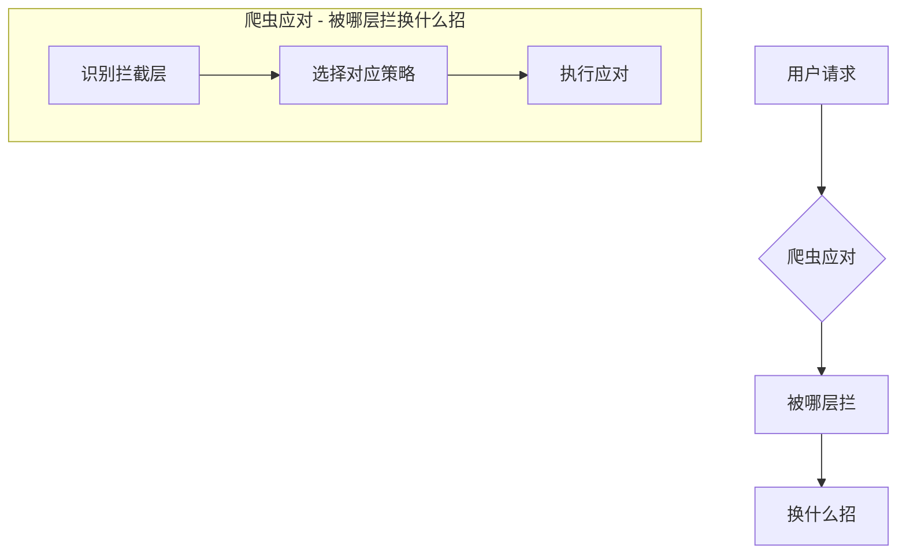

---
{
  "status": "active",
  "created": "2026-09-03",
  "updated": "2026-09-03",
  "source": "crawler-learning",
  "tags": [
    "爬虫",
    "反爬"
  ],
  "cards": [
    "crawler-1688重登撞上滑块-115",
    "crawler-WAF和四层检测体系是-117",
    "crawler-cookie失效至少有-122",
    "crawler-factorymoni-123",
    "crawler-headless无头浏-112",
    "crawler-凭证从生到死经历哪几个阶-121",
    "crawler-反爬检测体系分几层各层-109",
    "crawler-合法采集怎么设计对抗策略-120",
    "crawler-场景题PW抓京东2-113",
    "crawler-场景题requests-110",
    "crawler-工厂监控脚本被Clou-118",
    "crawler-浏览器指纹由什么组成为-111",
    "crawler-滑块验证码校验哪两点为-114",
    "crawler-风控系统按什么流程决定-119",
    "crawler-验证码为什么存在滑块-116"
  ]
}
---

# B4 反爬对抗 知识手册

> 用途：**学习/查阅**——知识点常新常查。
> 配套：错题复习 → B4-quiz.md ｜ 过程回溯 → B4-review.md
> 承接：B3 浏览器与渲染（CDP/无头浏览器/风控体系）→ 本阶段深挖"网站怎么识别爬虫、合法采集怎么活下来"。

## 目录

1. [必答问题](#1-必答问题)
2. [第 1 课 反爬全景：四层检测体系](#2-第-1-课-反爬全景四层检测体系)
3. [第 2 课 浏览器指纹](#3-第-2-课-浏览器指纹)
4. [第 3 课 验证码与人机验证](#4-第-3-课-验证码与人机验证)
5. [第 4 课 WAF 与风控系统](#5-第-4-课-waf-与风控系统)
6. [第 5 课 合法采集策略 + S3 凭证生命周期](#6-第-5-课-合法采集策略--s3-凭证生命周期)
7. [B4 总览图（毕业评审标准答案）](#7-b4-总览图毕业评审标准答案)
8. [参考要点](#8-参考要点)
9. [误解纠正](#9-误解纠正)
10. [费曼：一句话讲给外行](#10-费曼)

---

## 0. 开课摸底（认知锚点，2026-08-12）

> 对话式摸底，记录学习者已有认知，开课从锚点切入，不重复教。

- **已有 1：反爬全景两维度**（B3-10 留存）——"看访问频次、注入、指纹、签名，主要看**行为 + 特征**"：行为层（频次/轨迹）+ 特征层（指纹/签名）的框架已建立。
- **已有 2：实操三板斧**（真实踩坑经验）——① 存 cookie（凭证持久化，正是 S3 主题）② 冷却 IP 过几天再开（频率控制应对）③ Playwright 弹出手动划验证码（半自动人机对抗）。
- **空白 1：检测机制原理**——指纹怎么被采集、验证码怎么工作、WAF 怎么运作，都是黑盒。
- **空白 2：事前设计缺失**——三板斧全是"被识别后补救"，没有"如何不被识别"的事前策略。
- **空白 3：凭证生命周期未系统化**——知道"cookie 有时限、过期重新存"，但检测过期/刷新/轮换的完整链路没有（1688 COOKIE_EXPIRED 是活教材，S3 切入点）。

**开课策略**：从"被识别后怎么办"（文无熟悉）反向拆解"为什么会识别"（原理），最后落到"事前怎么设计"（策略）+ S3 凭证生命周期。

## 1. 必答问题

> 开课时定 3-5 题，读完能答 = 掌握。答不出 → 回对应章节重读。**= 毕业验收清单**。

1. 反爬检测体系分哪几层？各层看什么特征？层与层怎么配合？
2. 浏览器指纹是怎么生成的？为什么 Playwright 会被识别？怎么验证自己的环境像不像真人？
3. 验证码为什么存在？滑块/点选验证码的工作原理？（链接手动滑验证码经验）
4. 风控系统怎么决定"封不封你"？（规则 → 评分 → 动作的完整链路）
5. 合法采集怎么设计对抗策略？cookie 凭证怎么管理生命周期？（事前设计 + 链接 factory-monitor COOKIE_EXPIRED）

## 2. 第 1 课 反爬全景：四层检测体系

> 场景：文无的三板斧（存 cookie/冷却 IP/手动验证码）全是"被识别后怎么办"。反推：网站到底在哪一步认出你的？把"被识别"拆成"被哪一层识别"。
> 类比：**机场安检四道**（2026-08-12 新增，类比库已回写）——值机查证件（请求层）→ 安检机扫行李（特征层）→ 保安观察行为（行为层）→ 抽检开包/单独问话（内容层）。

**一句话**：反爬是**四层漏斗**——请求层（最便宜）→ 特征层 → 行为层 → 内容层（最贵），先廉价过滤，可疑才升级挑战；**被哪层拦，决定换什么招**。

### 四层检测体系

| 层 | 看什么 | 典型动作 | 类比 |
|----|--------|----------|------|
| ① 请求层 | UA 像不像浏览器、Headers 完整性、**访问频率**、IP 信誉（机房/代理池） | 429 限速、封 IP、拒 UA | 值机查证件 + 排队分流 |
| ② 特征层 | **浏览器指纹**：Canvas/WebGL/字体/时区/语言/屏幕参数，要求一致且自然 | 拒绝服务、进观察名单 | 安检机扫行李（证件真、包不对） |
| ③ 行为层 | 鼠标轨迹（直线瞬移=脚本）、点击/滚动节奏、停留时间、tab 切换 | 埋点 + 可疑分累积 | 保安观察走路姿势 |
| ④ 内容层 | **主动挑战**：验证码（滑块/点选）、WAF 规则、接口签名/加密参数 | 弹验证码、403、加密数据 | 抽检开包/单独问话 |

**关键点**：
- **漏斗逻辑**：按成本从低到高排，请求层几毫秒判完（只读头/计数），验证码最贵（影响真实用户、要人机对抗）——所以先廉价过滤，可疑才升级。
- **四层独立**：请求正常 ≠ 指纹正常 ≠ 行为正常（B3-10 已学：接口签名与浏览器指纹是两套体系，这里扩展成四套）。
- **被哪层拦 → 换什么招**（B3 §6 决策树升级版）：
  - ① 429/封 IP → 降频、换 IP、补 UA——**不用上浏览器**，requests 还能打
  - ② 指纹异常 → 环境问题，requests 直接抓不了；上 Playwright + 指纹修复，或改打接口
  - ③ 行为可疑 → 加人类行为模拟（轨迹/节奏）
  - ④ 验证码/签名 → 最贵；能绕就绕（找其他数据源/接口），不能绕才人机对抗
- **重试 = 升级导火索**（批次 28）：429 后死磕重试 = 告诉风控"我是脚本"（脚本才死磕）→ 被从①升级到④弹验证码。**退让才能让风控降级**（停手、降频、换会话）；脚本思维（重试/加速）是风控最喜欢的信号。

**PH 落点**：factory-monitor 1688 的 COOKIE_EXPIRED = 凭证层问题（S3，第 5 课展开）；1688 对裸 requests 通常 = 请求层（频率）+ 内容层（登录/验证码）组合。京东观察钩子：商品页反爬通常在②（指纹）或④（签名），页面本身无验证码。
**微题**：B4-quiz.md 批次 28。

## 3. 第 2 课 浏览器指纹

> 场景：B3 学过"PW 最易被识别（headless 指纹）"，但指纹是什么黑盒。揭开：指纹怎么生成、headless 为什么露馅、怎么验证自己像不像真人。
> 类比：**指纹 = 浏览器的生物特征**（2026-08-12 新增，类比库已回写）——cookie/UA 是证件（可伪造），GPU/字体/系统细节是身体特征（难伪造）。

**一句话**：浏览器指纹 = JS 能读到的**环境信息组合**，熵高到能唯一标识一个浏览器；headless 默认带着一堆可检测特征，但**可伪装——关键是全维度一致**。

### 指纹组成（JS 可读的环境信息）

| 维度       | 具体信息                               | 为什么难伪造        |
| -------- | ---------------------------------- | ------------- |
| Canvas   | JS 画图，不同 GPU/渲染引擎抗锯齿算法不同 → 像素数据不同  | 渲染器硬件差异，模拟成本高 |
| WebGL    | GPU 型号/渲染器字符串（如 "ANGLE (NVIDIA…)"） | 直接暴露硬件        |
| 字体列表     | 系统安装字体（JS 测量渲染宽度探测）                | 每台机器装的字体不同    |
| 系统参数     | 时区/语言/平台/屏幕分辨率/色深/触控点              | 与真实环境绑死       |
| UA + 一致性 | 以上所有 + UA 必须互相匹配                   | 单改一项就露馅       |

**为什么能唯一标识**：这些值组合的**熵**很高（几十 bit），两个浏览器完全一致的概率极低——等于给浏览器发了一张唯一"生物身份证"。

### headless 默认露馅点

1. `navigator.webdriver = true`（最经典，一查一个准）
2. 无 GPU → Canvas/WebGL 渲染结果与真机不同
3. 字体列表异常（容器里没装系统字体，字体探测差异大）
4. UA 与 platform 不匹配 / 时区默认 UTC / 语言默认 en-US / 屏幕尺寸默认

**关键认知**：不是"无头浏览器一定被识别"，而是"**默认配置的 headless 带着一堆可检测特征**"。可伪装（CDP 注入覆盖 webdriver、stealth 插件修指纹），但**伪装要全维度一致**——改了 UA 不改 platform、改了时区不改语言，照样露馅。

### 指纹的两副面孔

- **拦截**：把当前指纹与"已知爬虫指纹库"比对，命中就拦。
- **追踪**：不拦你，但记住指纹，**跨会话识别"还是那只爬虫"**——换 IP、换 cookie 都没用，指纹没变。这是比 IP 封禁更狠的一层。

### 怎么验证自己像不像真人

- 检测点：webdriver / UA-platform 匹配 / Canvas 噪声 / WebGL 渲染器 / 字体数 / 时区语言 / 屏幕。
- 在线检测页：`bot.sannysoft.com`、`arh.antoinevastel.com/bots/detection`（PW headless 打开，看哪些项红）。
- **修复 = 全维度伪装 + 复检闭环**（批次 29）：覆盖 webdriver（CDP 注入/stealth）→ 修 Canvas/WebGL 噪声与渲染器 → 字体补全 → 时区/语言/屏幕与 UA 一致 → **修完再过检测页复检，红了再修直到全绿**。
- **鉴别点**（批次 29）：抓 N 个商品后才弹滑块，可能不是指纹而是①层频率（抓太多）——体检全绿还弹 → 降频/换 IP。

**PH 落点**：未来在线直采用 PW → 默认 headless 会被②层识别 → 需 stealth/指纹修复，开工前先过检测页验证；京东观察钩子（商品页反爬在②指纹）——真做京东 PW 采集，第一步就是指纹体检。
**微题**：B4-quiz.md 批次 29。

## 4. 第 3 课 验证码与人机验证

> 场景：文无手动划过滑块（实操经验）——拆开黑盒：验证码为什么存在、怎么工作、对抗路径与边界。
> 类比：**验证码 = 机场安检最后一道的"考"**（2026-08-12 新增）——前几层都是"看"，内容层是"考"：直接出题考你是不是人。

**一句话**：验证码 = 网站主动出题，用"**人类容易、机器难**"的题目过滤爬虫；对抗的本质是"把机器伪装成能答题的人"。

### 为什么要有验证码

- 前三层（请求/特征/行为）是**被动观察**——你不动作它就看不出更多。
- 验证码是**主动挑战**：直接问"你是人吗"，答不上就拦。
- 设计原则：对人类**几乎零成本**（拖一下/点几张图），对机器**高成本**（算法/打码/真人）。

### 滑块验证码工作原理

1. 前端生成缺口图，缺口位置服务端下发（或加密藏在响应里）。
2. 拖动 → 前端采集**拖动轨迹**（坐标/速度/加速度/停顿）上报。
3. 服务端校验两点：**① 缺口位置对不对（几何）② 轨迹像不像人（行为）**——匀速直线 = 脚本，人类有加速减速和抖动。
4. 通过 → 发 token → 后续请求带 token 才放行。

> 所以滑块对抗不是"拖过去"就完事——**轨迹本身才是考点**。脚本匀速直线必死；要模拟人类轨迹（加速→减速→微调→停顿）。
> **人类轨迹典型形态**（批次 30）：加速段 → 减速段 → 接近缺口微调 → 停顿瞄准 → 落下；路径有 y 方向浮动（曲线）而非纯直线；常出现超调（拖过头再拉回一点）。

### 点选/文字/行为验证

- 点选：按提示点图中目标（"点出所有红绿灯"）——机器要过图像识别。
- 文字：扭曲字母数字——机器要过 OCR（识别率低）。
- 行为验证（无感）：不弹框，后台分析鼠标/触摸行为打"人机分"——最先进，用户无感。

### 对抗路径（从便宜到贵）

| 路径 | 做法 | 成本/风险 |
|------|------|----------|
| 绕 | 降频、换 IP、换会话——让风控不弹你 | 最便宜，优先做 |
| 打码平台 | 截图给真人/OCR 服务，返回答案 | 花钱、延迟、要接 API |
| 轨迹模拟 | 自己写人类轨迹算法（滑块） | 免费但调参，行为验证下失效 |
| 浏览器环境 | PW + 真实指纹 + 人工干预（文无划过的 pw 手动模式） | 半自动，慢 |
| 逆向 | 分析 JS 找 token 生成算法直接伪造 | 最贵，违反 ToS，不推荐（法律边界） |

**边界**：逆向签名/打码突破强验证码 = 灰色甚至违法；合法采集 = **尊重 ToS，能绕就绕，不能绕就降级或放弃**（正路：官方 API/授权数据源）。

**PH 落点**：文无的 pw 手动划验证码 = "浏览器环境+人工干预"档（半自动）；factory-monitor 1688 cookie 过期重登撞验证码 → 先"绕"（换会话/降频）再人工干预；京东滑块同款逻辑（轨迹才是考点）。
**微题**：B4-quiz.md 批次 30（交付于 2026-08-12 17:15，**待文无作答**）。

## 5. 第 4 课 WAF 与风控系统

> 场景：前三课是"网站怎么认人"，这一课是"网站怎么动手"——WAF 是门口的全自动保安，风控是总闸（记分制黑名单）。
> 类比：**WAF = 机场闸机+安检的自动化升级版**（机器自动拦，不用人盯）；**风控系统 = 机场记分制黑名单**（可疑一次记一分，够阈值拉黑/请喝茶）。

**一句话**：WAF 按**规则**过滤请求（业务服务器之前拦截）；风控系统按**评分**做决策（规则→打分→动作），是更大一层的总协调。

### WAF 是什么
- 应用层防火墙：请求到达业务服务器**之前**先过它，按规则拦截恶意/可疑流量。
- 常见形态：Cloudflare（免费版就有）、阿里云盾（1688 背后体系）、AWS WAF、ModSecurity。
- 拦截手段：速率限制（请求层）、UA/请求头规则、**攻击签名**（SQLi/XSS 特征）、IP 信誉（机房/代理池）、**JS 质询**。

### JS 质询（Cloudflare challenge）
- 表现：返回"检查你的浏览器…"页面（403/503 + 质询），要求**执行一段 JS 算出 token**，token 对了才放行。
- 为什么 requests 过不去：requests 是纯 HTTP 客户端，**不执行 JS** → 拿不到 token → 永远 403。
- **归属：内容层（④ 主动挑战）**——与验证码同类，是"考"不是"看"（批次 32 文无误判为特征层，已纠正：特征层是被动观察指纹）。
- 解法：真浏览器执行（PW）或 curl_cffi 等带 JS 执行/指纹模拟的客户端。

### 风控系统完整链路（必答问题 #4 正解）
```
采集（请求日志/埋点/指纹/行为）→ 特征计算 → 规则引擎 + 模型打分 → 决策 → 动作
```
- **决策维度**：IP、设备指纹、账号、会话——四维综合，单维可疑会累积。
- **名单管理**：黑名单（直接拦）/ 白名单（放行）/ **灰名单（观察记分）**。
- **动作分级**（从轻到重）：放行 → 观察记分（不拦但记着）→ 弹验证码 → 429 限速 → 封 IP → 封账号。
- 核心心智：风控是**分数制**不是"拦/不拦"二元——爬虫被慢慢记分，够阈值才动手；"退让降级"= 让分数回落。

### 与四层检测体系的关系
- WAF 横跨两处：速率限制/UA 规则 = 请求层（①）；JS 质询/验证码 = 内容层（④）。
- 风控系统 = **总协调器**：四层检测是"传感器"，风控是"大脑+手"（传感器上报 → 评分 → 动作）。

### 爬虫侧启示（批次 32 应对链路）
- 撞质询/403 先**鉴别**：是 JS 质询（内容层）还是 UA/速率被拦（请求层）？→ 看响应特征。
- 请求层 → 降频/换 UA 试试，**别急着上 PW**（便宜的步骤先走）。
- 真质询 → 上 PW（真实指纹）或 curl_cffi；仍不行 → 改打接口/找其他数据源/官方 API。
- 请求分布像人（随机间隔/低并发，衔接 S1 冷却期）；别带攻击特征（不触发 WAF 签名）；被灰名单观察 → **退让降频让分数回落**，别加速别重试。

**PH 落点**：factory-monitor 1688 现撞登录/验证码（内容层）；未来接 Cloudflare 类站点 → JS 质询，requests 直接跪，决策树上 PW/curl_cffi。S3 凭证生命周期（第 5 课）= "别让凭证失效触发重登→撞验证码"的事前设计。
**微题**：B4-quiz.md 批次 32（3 半对）。

## 6. 第 5 课 合法采集策略 + S3 凭证生命周期

> 场景：factory-monitor 的 1688 cookie 08-10 过期（COOKIE_EXPIRED 标记），需手动重登抓 cookie。为什么不能一劳永逸？为什么"重新登一下"还连环撞验证码？——凭证有**生命周期**，重登本身是风控敏感操作。系统化这套生命周期 = S3 凭证管理设计蓝图（B1 RFC 6265 在此串起）。
> 类比：**凭证 = 公司工牌**（2026-08-14 新增，类比库已回写）——有有效期（过期要补办）、会被吊销（离职/异常）、丢卡重办要走流程（人工介入）、同一个人多张卡（轮换池）。

**一句话**：凭证是通行证，有四阶段生命周期（颁发→存储→使用→失效→刷新重获）；爬虫侧要做**检测/刷新/轮换/降级**四件套，避免"失效→重登→撞墙"连锁。

### 凭证生命周期四阶段

颁发（Set-Cookie）→ 存储（持久化）→ 使用（回传 Cookie 头）→ 失效 → 刷新重获。
RFC 6265 四要素决定"什么时候回传、什么时候失效"：**Domain**（给哪个域）/ **Path**（哪些路径）/ **Secure**（仅 HTTPS 回传）/ **过期**（Expires/Max-Age）。

### 失效的 5 种原因（COOKIE_EXPIRED 只是其中一种的标记）

| 原因 | 机制 | 例子 |
|------|------|------|
| ① 过期 | Expires/Max-Age 到点（服务端给的死期） | 最常见 |
| ② 服务端注销 | 登出接口/服务端删会话 | 别处退出登录 |
| ③ 会话滑动过期 | 一段时间没活动就作废（idle 超时） | 很多站登录态是这种：看着没到期其实已死 |
| ④ 风控吊销 | 检测异常→强制下线（B4 第 4 课：被记分→踢下线） | 1688 常见 |
| ⑤ 环境绑定 | cookie 绑 UA/IP/指纹，换环境失效 | 换 IP 段就掉 |

### 为什么"过期重登"会连环撞验证码

重登 = 高频登录行为 = 风控特征（第 4 课：重试/重登是升级导火索）→ 触发内容层验证码。**凭证管理做得好 = 避免"失效→重登→撞墙"连锁**——事前设计（开课摸底"空白 2"的答案）。

### S3 凭证管理四件套（设计蓝图）

1. **检测**：**主动探活**——定时发轻量请求（需登录态的轻接口），看响应特征（跳登录页/未登录 JSON/特定字段）判断死活；**优于被动发现**（等 403/登录页才反应 = 整批请求已全挂）。
2. **刷新**：分级——自动重登（有账号密码→自动化登录重新拿 cookie）→ 半自动（扫码/打码兜底）→ 人工介入（factory-monitor 现状：标记→通知人）。
3. **轮换**：cookie 池多凭证轮换，单凭证降频（第 4 课：别让单个凭证触发频次风控）。
4. **降级**：失效且无法立即重获 → 静默/降频/换数据源，别硬刚。

**PH 落点**：factory-monitor 现状 = 被动检测（COOKIE_EXPIRED 标记→人工刷新）。S3 按四件套补：① 探活检测（主动）② 刷新分级（自动重登优先）③ 轮换池 ④ 失效降级。P3 阶段产品侧实现。
**微题**：B4-quiz.md 批次 37（交付于 2026-08-14 18:02，**待文无作答**）。

### 钩子池（深入一问登记，毕业评审组卷素材）

| # | 钩子 | 来源 | 状态 |
|---|------|------|------|
| H1 | 京东 React 主包 defer 还是 async？首屏为何快（SSR 部分）？ | B3 遗留钩子（可选观察） | 待揭晓 |
| H2 | 京东商品数据是哪个 XHR/fetch 接口返回？参数带签名吗？ | B3 遗留钩子（可选观察） | 待揭晓 |
| H3 | 1688 重登撞滑块，"绕→打码→轨迹→PW"四档实战验证（第一步该做什么） | 第 3 课 PH 落点 | 待揭晓 |
| H4 | factory-monitor COOKIE_EXPIRED：四件套里先补哪件最值（探活检测？） | 第 5 课 PH 落点 | 待揭晓 |
| H3 | 1688 重登撞滑块，"绕→打码→轨迹→PW"四档实战验证（第一步该做什么） | 第 3 课 PH 落点 | ✅ 已用（毕业评审 Q6，层归属重点轮） |
| H4 | factory-monitor COOKIE_EXPIRED：四件套里先补哪件最值（探活检测？） | 第 5 课 PH 落点 | ✅ 已覆盖（Q5 必答） |
| H5 | 风控"记分制"：被灰名单后降频多久分数能回落？有公开案例吗 | 第 4 课 | ✅ 已用（毕业评审 Q7） |
| H6 | 重登撞滑块四档层归属：绕=请求层/打码=内容层硬刚/轨迹=行为层/PW=特征层+行为层（非内容层）；打码排第二=治标不治本 + 换战场 vs 硬刚 | 毕业评审 Q6 修正 | ⚠️ 重点轮（1 天） |

## 7. B4 总览图（毕业评审标准答案）



## 8. 参考要点

| 主题 | 出处 | 要点 |
|------|------|------|
| （待补） | | |

## 9. 误解纠正

> 初学时的错误心智模型 → 被什么证据纠正。最重要的一节。

1. **“灰名单应对 = 先鉴别哪层卡了 + 模拟真人特征”** → 错因：把应对质询/指纹的通用话术套到风控评分场景。灰名单 = 已被记分，无需鉴别，唯一出路是**退让降级让分数回落**（降频/换干净 IP/会话/停手）；加速/重试 = 记分飙升的最坏操作。（批次 33，2026-08-14）

## 10. 费曼

> 一句话讲给外行：讲不清楚 = 没懂。

（结课补）

## 回顾
<!-- cards: crawler-1688重登撞上滑块-115, crawler-WAF和四层检测体系是-117, crawler-cookie失效至少有-122, crawler-factorymoni-123, crawler-headless无头浏-112, crawler-凭证从生到死经历哪几个阶-121, crawler-反爬检测体系分几层各层-109, crawler-合法采集怎么设计对抗策略-120, crawler-场景题PW抓京东2-113, crawler-场景题requests-110, crawler-工厂监控脚本被Clou-118, crawler-浏览器指纹由什么组成为-111, crawler-滑块验证码校验哪两点为-114, crawler-风控系统按什么流程决定-119, crawler-验证码为什么存在滑块-116 -->
- Q: 反爬检测体系分几层？各层看什么特征？层与层怎么配合？
  A: - 四层：请求层（UA/Header/频率/IP）→ 特征层（浏览器指纹）→ 行为层（轨迹/速度/交互）→ 内容层（主动挑战：验证码/WAF/签名）
  - **漏斗逻辑**：成本从低到高逐层升级、便宜的先用来贵的兜底；99% 真人被廉价层放行（别烦真人 = 用户体验维度）

- Q: 场景题：requests 抓 1688，50 页后 429，重试几次后弹验证码。哪两层在拦？怎么应对？
  A: - 429=请求层 / 验证码=内容层
  - 应对链：**立即停手（重试=升级导火索，脚本才会死磕）** → 看 Retry-After → 降频加随机间隔 → 换 IP/补 UA → 仍不行才上 PW；退让才能让风控降级

- Q: 浏览器指纹由什么组成？为什么能唯一标识？
  A: - 组成四类：Canvas / WebGL / 字体列表 / 系统参数
  - 唯一性：信息极其丰富、熵高难复制
  - **一致性**：UA 与所有特征互相匹配（时区/语言/屏幕与 UA 一致），风控专抓不一致

- Q: headless（无头浏览器）默认露馅点有哪些？
  A: navigator.webdriver=true / 无 GPU→Canvas/WebGL 渲染差异 / 字体列表异常 / UA 与 platform 不匹配 / 时区默认 UTC / 语言 en-US / 屏幕默认

- Q: 场景题：PW 抓京东 200 商品后弹滑块。先怎么鉴别？怎么修？修完怎么确认？
  A: - **鉴别先行**：200 商品后才弹滑块 → 先分**指纹 vs 频率**（固定页数后弹更像频率；体检全绿还弹 → 降频/换 IP）
  - 验证：过检测页（bot.sannysoft.com 类）体检——webdriver / UA-platform / Canvas 噪声 / WebGL 渲染器 / 字体数 / 时区语言 / 屏幕
  - 修复：全维度伪装 ① 覆盖 navigator.webdriver（CDP 注入/stealth）② 修 Canvas/WebGL 噪声与渲染器 ③ 字体补全 ④ 时区/语言/屏幕与 UA 一致 → **复检闭环：红了再修直到全绿**

- Q: 滑块验证码校验哪两点？为什么脚本"匀速直线拖动"必死？自己写脚本过滑块，轨迹要模拟成什么样才像人（至少 3 个特征）？
  A: - 校验两点：几何位置（停靠缺口）+ 轨迹行为
  - 人类轨迹链：加速段 → 减速段 → 接近缺口微调 → 停顿瞄准 → 落下；特征=不规则（随机/抖动）、节奏（快慢变速）、超调、y 方向曲线浮动
  - 匀速直线 = 机器专属动作，必死

- Q: 1688 重登撞上滑块，按什么顺序尝试（绕/打码/轨迹/PW 四档）？每档属于反爬哪一层？为什么打码治标不治本？
  A: - 顺序（便宜→贵）：① 绕（降频/换 IP/换会话 = 换战场，先退让）→ ② 打码（付费 API，内容层硬刚）→ ③ 轨迹模拟（免费但调参）→ ④ PW（特征层+行为层全维）→ 逆向不推荐（灰色违法）
  - 层归属：绕=请求层 / 打码=内容层 / 轨迹=行为层 / **PW=特征层+行为层**（换整个身份去考试，不是"蒙混"）
  - 打码治标不治本：**重登=高频敏感行为=风控导火索**，打码只解这一次、下次还撞；绕=不玩对手的游戏，打码=在对手游戏里花钱硬刚

- Q: 验证码为什么存在？滑块/点选验证码的工作原理？
  A: - 存在理由：人机区分——人类低成本/机器高成本的经济学本质（人机对抗最后一道工序）
  - 滑块：几何位置+轨迹行为；点选：图片语义识别（选指定物体）+ 点击坐标与行为
  - 记忆点：滑块考两点——落点对不对 + 怎么滑过来的

- Q: WAF 和四层检测体系是什么关系？Cloudflare 质询页算哪一层？为什么 requests 过不去？
  A: - WAF 不是独立层：横跨请求层（速率/UA 规则）+ 内容层（JS 质询/验证码）
  - **JS 质询 = 内容层主动挑战（"考"），非特征层**：特征层是"看"（被动观察指纹），内容层是"考"（要执行 JS 算 token）
  - requests 不执行 JS → 拿不到 token → 永远 403

- Q: 工厂监控脚本被 Cloudflare 质询页挡了（403），requests 过不去。按什么顺序处理？
  A: - ① 鉴别：先确认是否真质询（403/503 + challenge 特征页）；也可能是 UA 被拦/速率限制 = 请求层
  - ② 请求层问题先降频/换 UA（便宜步骤先走，别急着上最贵的）
  - ③ 真质询才上 PW（真实指纹）/ curl_cffi
  - ④ 改道兜底：仍不行 → 打接口 / 其他数据源 / 官方 API
  - 记忆点：**鉴别 → 分层 → 改道**

- Q: 风控系统按什么流程决定"封不封你"？被"观察"（灰名单）了该做什么、不该做什么？
  A: - 链路五步：采集（日志/埋点/指纹/行为）→ 特征计算 → 规则引擎+模型打分 → 决策 → 动作；四维=IP/设备指纹/账号/会话；名单=黑/白/灰；动作分级=放行→观察计分→弹验证码→429限速→封IP→封账号
  - 灰名单应对：该做=退让降频（随机间隔、降并发）、换干净 IP/会话、等待冷却让分数回落（指数退避+定时探活）；不该做=别加速别重试（记分飙升）、别硬刚验证码
  - 记忆点：灰名单=记分制，唯一出路是让分数降下来；跨模块：与 S1 monitor 冷却器同构（冷却防重复动作 vs 灰名单冷却防风控升级）

- Q: 合法采集怎么设计对抗策略（不触发风控）？
  A: - 请求分布稀疏不集中（别高频集中）
  - 特征伪造与真实浏览器一致
  - 攻击性降低不高频（别重试别加速——脚本思维是风控最喜欢的信号）

- Q: 凭证从生到死经历哪几个阶段？RFC 6265 的哪四个要素决定"什么时候回传、什么时候失效"？
  A: - 四阶段闭环：颁发 → 存储 → 使用 → 失效 → 刷新重获
  - RFC 6265 四要素（决定何时回传/何时失效）：Domain / Path / Secure / 过期
  - 类比：凭证=公司工牌（有有效期/会吊销/重办走流程/多张卡=轮换池）

- Q: cookie 失效至少有 5 种原因，分别是什么？判断场景：cookie 的 Expires 明明没过期，但长时间没活动后请求突然跳登录页——这是哪种失效？
  A: - ① 过期（Expires/Max-Age 到点）② 服务端注销（踢下线）③ 会话滑动过期（idle 超时作废——看着没过期其实已死）④ 风控吊销 ⑤ 环境绑定变化（UA/IP/设备变更）

- Q: factory-monitor 现在是被动检测（等 403/登录页才发现 cookie 挂了 → 标记 → 人工重登）。按 S3 四件套设计蓝图（检测/刷新/轮换/降级），先补哪一件最值？为什么主动探活优于被动发现？
  A: - 四件套：检测 / 刷新 / 轮换 / 降级
  - 检测=**主动探活**：定时发轻量请求（需登录态的轻接口）看响应特征判断死活；刷新分级=自动重登→半自动（扫码/打码）→人工介入；轮换=cookie 池多凭证；降级=失效降频
  - **主动探活理由 = 时间差**：cookie 一死立刻发现（业务请求未发、损失为零）；被动=业务请求整批 403 才反应 → 损失整批 + 重登撞验证码连锁。**不是"像真人"**——被动才是打草惊蛇
  - 安全标准：连续 N 次探活正常（无 403/无验证码）→ 逐步恢复频率
